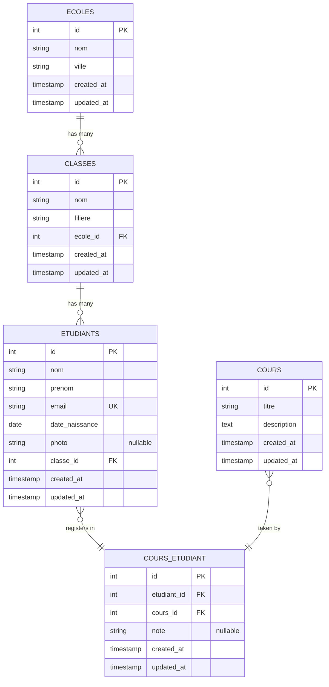
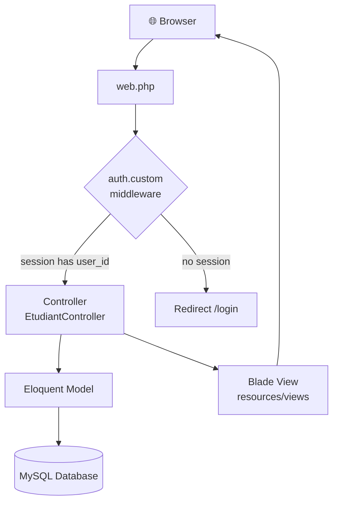

# 🏫 Laravel School Management — Complete Course

<p align="center">
  
  
  
  
  
</p>

<p align="center">
  <b>App:</b> School Management <code>Ecole → Classe → Etudiant ↔ Cours</code><br>
  <b>One complete project covering the full OFPPT Laravel course — from zero to deployed CRUD.</b>
</p>

---

## 📋 Table of Contents

| # | Step | Topic |
|---|------|-------|
| 1 | [🛠️ Step 1 — Create the Project](#-step-1--create-the-project) | `composer create-project` |
| 2 | [⚡ Step 2 — Artisan Commands](#-step-2--artisan-commands) | Models, migrations, controllers, middleware |
| 3 | [🗄️ Step 3 — Migrations](#-step-3--migrations) | DB schema for all 5 tables |
| 4 | [🤖 Step 4 — Models](#-step-4--models) | Eloquent relationships (hasMany, belongsTo, belongsToMany) |
| 5 | [🏭 Step 5 — Factory](#-step-5--factory) | Fake data generator |
| 6 | [🌱 Step 6 — Seeder](#-step-6--seeder) | Seed schools, classes, courses + 20 students |
| 7 | [🔒 Step 7 — Middleware](#-step-7--middleware) | Custom auth middleware |
| 8 | [🛣️ Step 8 — Routes](#-step-8--routes) | Resource routes + middleware group |
| 9 | [🎮 Step 9 — Controller](#-step-9--controller) | Full CRUD with image upload + pivot sync |
| 10 | [🎨 Step 10 — Blade Views](#-step-10--blade-views) | Layout, index, create, edit, show |
| 11 | [📊 Step 11 — Eloquent Queries](#-step-11--eloquent-queries-exam-style) | Exam-style query examples |
| | [✅ Final Checklist](#-final-checklist--before-writing-in-the-exam) | Cram sheet for the exam |

---

## 📖 Overview

This repository is a **step-by-step Laravel tutorial** that builds a complete **School Management System**. It covers every topic in the OFPPT Laravel curriculum:

| Concept | What you'll learn |
|---------|------------------|
| **1-to-many** | School → Classes → Students |
| **Many-to-many** | Students ↔ Courses (with pivot table + notes) |
| **CRUD** | Full Create-Read-Update-Delete with image upload |
| **Validation** | Server-side `$request->validate()` rules |
| **Middleware** | Custom auth guard protecting routes |
| **Factories & Seeders** | Generate fake data for testing |
| **Eloquent** | `hasMany`, `belongsTo`, `belongsToMany`, `hasManyThrough`, `withCount`, `sync` |

---

## 🗺️ Entity Relationship Diagram



---

## 🔄 Architecture Flow



---

## 🛠️ Step 1 — Create the Project

```bash
composer create-project --prefer-dist laravel/laravel school-app
cd school-app
php artisan key:generate
php artisan serve
```

---

## ⚡ Step 2 — Artisan Commands

### Models + Migrations

```bash
php artisan make:model Ecole -m
php artisan make:model Classe -m
php artisan make:model Etudiant -mcrf
php artisan make:model Cours -m
```

### Pivot Table (no model needed)

```bash
php artisan make:migration create_cours_etudiant_table
```

### Controllers

```bash
php artisan make:controller EcoleController --resource
php artisan make:controller CoursController --resource
```

### Middleware

```bash
php artisan make:middleware AuthMiddleware
```

### Seeder + Factory

```bash
php artisan make:seeder EtudiantSeeder
php artisan make:seeder DatabaseSeeder
```

---

## 🗄️ Step 3 — Migrations

### `ecoles`

```php
// database/migrations/xxxx_create_ecoles_table.php
public function up()
{
    Schema::create('ecoles', function (Blueprint $table) {
        $table->id();
        $table->string('nom');
        $table->string('ville');
        $table->timestamps();
    });
}
```

### `classes`

```php
public function up()
{
    Schema::create('classes', function (Blueprint $table) {
        $table->id();
        $table->string('nom');
        $table->string('filiere');
        $table->foreignId('ecole_id')->constrained('ecoles')->onDelete('cascade');
        $table->timestamps();
    });
}
```

### `etudiants`

```php
public function up()
{
    Schema::create('etudiants', function (Blueprint $table) {
        $table->id();
        $table->string('nom');
        $table->string('prenom');
        $table->string('email')->unique();
        $table->date('date_naissance');
        $table->string('photo')->nullable();
        $table->foreignId('classe_id')->constrained('classes')->onDelete('cascade');
        $table->timestamps();
    });
}
```

### `cours`

```php
public function up()
{
    Schema::create('cours', function (Blueprint $table) {
        $table->id();
        $table->string('titre');
        $table->text('description');
        $table->timestamps();
    });
}
```

### `cours_etudiant` (PIVOT — many to many)

```php
public function up()
{
    Schema::create('cours_etudiant', function (Blueprint $table) {
        $table->id();
        $table->foreignId('etudiant_id')->constrained('etudiants')->onDelete('cascade');
        $table->foreignId('cours_id')->constrained('cours')->onDelete('cascade');
        $table->string('note')->nullable();
        $table->timestamps();
    });
}
```

### Run All Migrations

```bash
php artisan migrate
```

---

## 🤖 Step 4 — Models

### Ecole

```php
<?php
namespace App\Models;

use Illuminate\Database\Eloquent\Model;

class Ecole extends Model
{
    protected $fillable = ['nom', 'ville'];

    // One school HAS MANY classes
    public function classes()
    {
        return $this->hasMany(Classe::class);
    }

    // One school HAS MANY students THROUGH classes
    public function etudiants()
    {
        return $this->hasManyThrough(Etudiant::class, Classe::class);
    }
}
```

### Classe

```php
<?php
namespace App\Models;

use Illuminate\Database\Eloquent\Model;

class Classe extends Model
{
    protected $fillable = ['nom', 'filiere', 'ecole_id'];

    // One class BELONGS TO one school
    public function ecole()
    {
        return $this->belongsTo(Ecole::class);
    }

    // One class HAS MANY students
    public function etudiants()
    {
        return $this->hasMany(Etudiant::class);
    }
}
```

### Etudiant

```php
<?php
namespace App\Models;

use Illuminate\Database\Eloquent\Model;

class Etudiant extends Model
{
    protected $fillable = ['nom', 'prenom', 'email', 'date_naissance', 'photo', 'classe_id'];

    // BELONGS TO one class
    public function classe()
    {
        return $this->belongsTo(Classe::class);
    }

    // BELONGS TO MANY courses (many-to-many)
    public function cours()
    {
        return $this->belongsToMany(Cours::class, 'cours_etudiant')
                    ->withPivot('note')
                    ->withTimestamps();
    }
}
```

### Cours

```php
<?php
namespace App\Models;

use Illuminate\Database\Eloquent\Model;

class Cours extends Model
{
    protected $fillable = ['titre', 'description'];

    // BELONGS TO MANY students (many-to-many)
    public function etudiants()
    {
        return $this->belongsToMany(Etudiant::class, 'cours_etudiant')
                    ->withPivot('note')
                    ->withTimestamps();
    }
}
```

### Relationship Summary

| Model | Relation | Opposite | Type |
|-------|----------|----------|------|
| `Ecole` | `classes()` | `Classe::ecole()` | `hasMany` / `belongsTo` |
| `Ecole` | `etudiants()` | — | `hasManyThrough` |
| `Classe` | `etudiants()` | `Etudiant::classe()` | `hasMany` / `belongsTo` |
| `Etudiant` | `cours()` | `Cours::etudiants()` | `belongsToMany` (with pivot) |

---

## 🏭 Step 5 — Factory

```php
<?php
// database/factories/EtudiantFactory.php
namespace Database\Factories;

use Illuminate\Database\Eloquent\Factories\Factory;

class EtudiantFactory extends Factory
{
    public function definition(): array
    {
        return [
            'nom'            => $this->faker->lastName(),
            'prenom'         => $this->faker->firstName(),
            'email'          => $this->faker->unique()->safeEmail(),
            'date_naissance' => $this->faker->date(),
            'photo'          => null,
            'classe_id'      => \App\Models\Classe::inRandomOrder()->first()->id,
        ];
    }
}
```

---

## 🌱 Step 6 — Seeder

```php
<?php
// database/seeders/DatabaseSeeder.php
namespace Database\Seeders;

use Illuminate\Database\Seeder;

class DatabaseSeeder extends Seeder
{
    public function run()
    {
        // Insert fixed schools
        $ecole1 = \App\Models\Ecole::create(['nom' => 'ISTA MAAMOURA', 'ville' => 'Kenitra']);
        $ecole2 = \App\Models\Ecole::create(['nom' => 'ISTA SALE',     'ville' => 'Sale']);

        // Insert classes linked to schools
        $classe1 = \App\Models\Classe::create(['nom' => '2A', 'filiere' => 'DEVOWFS', 'ecole_id' => $ecole1->id]);
        $classe2 = \App\Models\Classe::create(['nom' => '2B', 'filiere' => 'DEVOWFS', 'ecole_id' => $ecole2->id]);

        // Insert courses
        \App\Models\Cours::create(['titre' => 'Laravel', 'description' => 'Framework PHP']);
        \App\Models\Cours::create(['titre' => 'MySQL',   'description' => 'Base de données']);

        // Generate 20 fake students using factory
        \App\Models\Etudiant::factory(20)->create();
    }
}
```

```bash
php artisan db:seed
```

---

## 🔒 Step 7 — Middleware

### Create

```bash
php artisan make:middleware AuthMiddleware
```

### `AuthMiddleware.php`

```php
<?php
namespace App\Http\Middleware;

use Closure;
use Illuminate\Http\Request;

class AuthMiddleware
{
    public function handle(Request $request, Closure $next)
    {
        // Check if user is logged in via session
        if (!session()->has('user_id')) {
            return redirect('/login');
        }

        return $next($request);
    }
}
```

### Register in `app/Http/Kernel.php`

```php
protected $routeMiddleware = [
    // ... existing middlewares
    'auth.custom' => \App\Http\Middleware\AuthMiddleware::class,
];
```

---

## 🛣️ Step 8 — Routes (`web.php`)

```php
<?php
use Illuminate\Support\Facades\Route;
use App\Http\Controllers\EtudiantController;
use App\Http\Controllers\EcoleController;
use App\Http\Controllers\CoursController;

// Public routes
Route::get('/', function () {
    return redirect()->route('etudiants.index');
});

// Protected routes — apply middleware to the whole group
Route::middleware(['auth.custom'])->group(function () {

    // Etudiant — full resource (7 routes)
    Route::resource('etudiants', EtudiantController::class);

    // Ecole — full resource
    Route::resource('ecoles', EcoleController::class);

    // Cours — full resource
    Route::resource('cours', CoursController::class);
});
```

---

## 🎮 Step 9 — EtudiantController (FULL CRUD)

```php
<?php
namespace App\Http\Controllers;

use App\Models\Etudiant;
use App\Models\Classe;
use App\Models\Cours;
use Illuminate\Http\Request;

class EtudiantController extends Controller
{
    // Apply middleware to all methods except index
    public function __construct()
    {
        $this->middleware('auth.custom')->except(['index']);
    }

    // GET /etudiants — list all students with pagination
    public function index()
    {
        $etudiants = Etudiant::with(['classe', 'cours'])->paginate(10);
        return view('etudiants.index', compact('etudiants'));
    }

    // GET /etudiants/create — show create form
    public function create()
    {
        $classes = Classe::all();
        $cours   = Cours::all();
        return view('etudiants.create', compact('classes', 'cours'));
    }

    // POST /etudiants — store with image upload + many-to-many
    public function store(Request $request)
    {
        $request->validate([
            'nom'            => 'required',
            'prenom'         => 'required',
            'email'          => 'required|email|unique:etudiants',
            'date_naissance' => 'required|date',
            'classe_id'      => 'required',
            'photo'          => 'nullable|image|mimes:jpeg,png,jpg|max:2048',
        ]);

        // Handle image upload
        $photoPath = null;
        if ($request->hasFile('photo')) {
            $photoPath = $request->file('photo')->store('photos', 'public');
        }

        // Create student
        $etudiant = Etudiant::create([
            'nom'            => $request->nom,
            'prenom'         => $request->prenom,
            'email'          => $request->email,
            'date_naissance' => $request->date_naissance,
            'classe_id'      => $request->classe_id,
            'photo'          => $photoPath,
        ]);

        // Attach selected courses to student (many-to-many)
        if ($request->has('cours')) {
            $etudiant->cours()->attach($request->cours);
        }

        return redirect()->route('etudiants.index');
    }

    // GET /etudiants/{id} — show one student
    public function show($id)
    {
        $etudiant = Etudiant::with(['classe.ecole', 'cours'])->findOrFail($id);
        return view('etudiants.show', compact('etudiant'));
    }

    // GET /etudiants/{id}/edit — show edit form
    public function edit($id)
    {
        $etudiant = Etudiant::findOrFail($id);
        $classes  = Classe::all();
        $cours    = Cours::all();
        // IDs of courses already attached to this student
        $selectedCours = $etudiant->cours->pluck('id')->toArray();
        return view('etudiants.edit', compact('etudiant', 'classes', 'cours', 'selectedCours'));
    }

    // PUT /etudiants/{id} — update student
    public function update(Request $request, $id)
    {
        $request->validate([
            'nom'            => 'required',
            'prenom'         => 'required',
            'email'          => 'required|email|unique:etudiants,email,' . $id,
            'date_naissance' => 'required|date',
            'classe_id'      => 'required',
            'photo'          => 'nullable|image|mimes:jpeg,png,jpg|max:2048',
        ]);

        $etudiant = Etudiant::findOrFail($id);

        // Handle new image upload
        if ($request->hasFile('photo')) {
            // Delete old photo
            \Storage::disk('public')->delete($etudiant->photo);
            $etudiant->photo = $request->file('photo')->store('photos', 'public');
        }

        $etudiant->nom            = $request->nom;
        $etudiant->prenom         = $request->prenom;
        $etudiant->email          = $request->email;
        $etudiant->date_naissance = $request->date_naissance;
        $etudiant->classe_id      = $request->classe_id;
        $etudiant->save();

        // Sync courses (replaces old pivot records with new selection)
        $etudiant->cours()->sync($request->cours ?? []);

        return redirect()->route('etudiants.index');
    }

    // DELETE /etudiants/{id} — delete student + image
    public function destroy($id)
    {
        $etudiant = Etudiant::findOrFail($id);

        // Delete photo from storage
        if ($etudiant->photo) {
            \Storage::disk('public')->delete($etudiant->photo);
        }

        // Detach all courses from pivot table
        $etudiant->cours()->detach();

        $etudiant->delete();

        return redirect()->route('etudiants.index');
    }
}
```

---

## 🎨 Step 10 — Blade Views

### `layouts/app.blade.php`

```html
<!DOCTYPE html>
<html>
<head>
    <title>School App</title>
</head>
<body>
    <nav>
        <a href="{{ route('etudiants.index') }}">Etudiants</a> |
        <a href="{{ route('ecoles.index') }}">Ecoles</a> |
        <a href="{{ route('cours.index') }}">Cours</a>
    </nav>
    <hr>
    @yield('content')
</body>
</html>
```

### `etudiants/index.blade.php`

```html
@extends('layouts.app')

@section('content')
    <h1>Liste des Etudiants</h1>
    <a href="{{ route('etudiants.create') }}">Ajouter un Etudiant</a>

    <table border="1">
        <tr>
            <th>Photo</th>
            <th>Nom</th>
            <th>Prénom</th>
            <th>Email</th>
            <th>Classe</th>
            <th>Ecole</th>
            <th>Cours</th>
            <th>Actions</th>
        </tr>

        @foreach($etudiants as $e)
        <tr>
            <td>
                @if($e->photo)
                    photo) }}" width="60">
                @else
                    Aucune photo
                @endif
            </td>
            <td>{{ $e->nom }}</td>
            <td>{{ $e->prenom }}</td>
            <td>{{ $e->email }}</td>
            <td>{{ $e->classe->nom }}</td>
            <td>{{ $e->classe->ecole->nom }}</td>
            <td>
                @foreach($e->cours as $c)
                    {{ $c->titre }} ({{ $c->pivot->note ?? 'N/A' }}),
                @endforeach
            </td>
            <td>
                <a href="{{ route('etudiants.show', $e->id) }}">Voir</a>
                <a href="{{ route('etudiants.edit', $e->id) }}">Modifier</a>

                <form action="{{ route('etudiants.destroy', $e->id) }}" method="POST">
                    @csrf
                    @method('DELETE')
                    <button type="submit">Supprimer</button>
                </form>
            </td>
        </tr>
        @endforeach
    </table>

    {{-- Pagination links --}}
    {{ $etudiants->links() }}
@endsection
```

### `etudiants/create.blade.php`

```html
@extends('layouts.app')

@section('content')
    <h1>Ajouter un Etudiant</h1>

    <form action="{{ route('etudiants.store') }}" method="POST" enctype="multipart/form-data">
        @csrf

        <label>Nom</label>
        <input type="text" name="nom">

        <label>Prénom</label>
        <input type="text" name="prenom">

        <label>Email</label>
        <input type="email" name="email">

        <label>Date de naissance</label>
        <input type="date" name="date_naissance">

        <label>Photo</label>
        <input type="file" name="photo">

        {{-- Select class (one-to-many) --}}
        <label>Classe</label>
        <select name="classe_id">
            @foreach($classes as $classe)
                <option value="{{ $classe->id }}">{{ $classe->nom }} - {{ $classe->ecole->nom }}</option>
            @endforeach
        </select>

        {{-- Select courses (many-to-many) — multiple selection --}}
        <label>Cours</label>
        <select name="cours[]" multiple>
            @foreach($cours as $c)
                <option value="{{ $c->id }}">{{ $c->titre }}</option>
            @endforeach
        </select>

        <button type="submit">Enregistrer</button>
        <a href="{{ route('etudiants.index') }}">Retour</a>
    </form>
@endsection
```

### `etudiants/edit.blade.php`

```html
@extends('layouts.app')

@section('content')
    <h1>Modifier l'Etudiant</h1>

    <form action="{{ route('etudiants.update', $etudiant->id) }}" method="POST" enctype="multipart/form-data">
        @csrf
        @method('PUT')

        <label>Nom</label>
        <input type="text" name="nom" value="{{ $etudiant->nom }}">

        <label>Prénom</label>
        <input type="text" name="prenom" value="{{ $etudiant->prenom }}">

        <label>Email</label>
        <input type="email" name="email" value="{{ $etudiant->email }}">

        <label>Date de naissance</label>
        <input type="date" name="date_naissance" value="{{ $etudiant->date_naissance }}">

        {{-- Show current photo --}}
        @if($etudiant->photo)
            photo) }}" width="80"><br>
        @endif
        <label>Nouvelle photo (optionnel)</label>
        <input type="file" name="photo">

        {{-- Select class --}}
        <label>Classe</label>
        <select name="classe_id">
            @foreach($classes as $classe)
                <option value="{{ $classe->id }}"
                    {{ $etudiant->classe_id == $classe->id ? 'selected' : '' }}>
                    {{ $classe->nom }}
                </option>
            @endforeach
        </select>

        {{-- Select courses — pre-select already attached courses --}}
        <label>Cours</label>
        <select name="cours[]" multiple>
            @foreach($cours as $c)
                <option value="{{ $c->id }}"
                    {{ in_array($c->id, $selectedCours) ? 'selected' : '' }}>
                    {{ $c->titre }}
                </option>
            @endforeach
        </select>

        <button type="submit">Mettre à jour</button>
        <a href="{{ route('etudiants.index') }}">Retour</a>
    </form>
@endsection
```

### `etudiants/show.blade.php`

```html
@extends('layouts.app')

@section('content')
    <h1>Détails de l'Etudiant</h1>

    @if($etudiant->photo)
        photo) }}" width="120">
    @endif

    <p>Nom : {{ $etudiant->nom }}</p>
    <p>Prénom : {{ $etudiant->prenom }}</p>
    <p>Email : {{ $etudiant->email }}</p>
    <p>Date de naissance : {{ $etudiant->date_naissance }}</p>
    <p>Classe : {{ $etudiant->classe->nom }}</p>
    <p>Ecole : {{ $etudiant->classe->ecole->nom }} — {{ $etudiant->classe->ecole->ville }}</p>

    <h3>Cours inscrits :</h3>
    <ul>
        @foreach($etudiant->cours as $c)
            <li>{{ $c->titre }} — Note: {{ $c->pivot->note ?? 'Non notée' }}</li>
        @endforeach
    </ul>

    <a href="{{ route('etudiants.edit', $etudiant->id) }}">Modifier</a>
    <a href="{{ route('etudiants.index') }}">Retour</a>
@endsection
```

---

## 📊 Step 11 — Eloquent Queries (Exam Style)

```php
// All students of a specific school
$etudiants = Ecole::where('nom', 'ISTA MAAMOURA')->first()->etudiants;

// School with the most students
$ecole = Ecole::withCount('etudiants')->orderBy('etudiants_count', 'desc')->first();

// Students with at least one course
$etudiants = Etudiant::has('cours')->get();

// Students with their courses count
$etudiants = Etudiant::withCount('cours')->get();

// All courses of a student
$cours = Etudiant::find(1)->cours;

// Access pivot data (note)
foreach (Etudiant::find(1)->cours as $c) {
    echo $c->titre . ' - ' . $c->pivot->note;
}

// Attach a course to a student
Etudiant::find(1)->cours()->attach($coursId, ['note' => '15/20']);

// Detach a course
Etudiant::find(1)->cours()->detach($coursId);

// Sync (replace all course relations)
Etudiant::find(1)->cours()->sync([1, 2, 3]);
```

---

## ✅ Final Checklist — Before Writing in the Exam

| Must Have | Code |
|-----------|------|
| Project creation | `composer create-project --prefer-dist laravel/laravel` |
| Model + migration | `php artisan make:model X -m` |
| Resource controller | `php artisan make:controller XController --resource` |
| Foreign key | `$table->foreignId('x_id')->constrained('xs')` |
| `$fillable` in model | `protected $fillable = [...]` |
| `hasMany` | Parent model |
| `belongsTo` | Child model (has the foreign key) |
| `belongsToMany` | Both models, needs pivot table |
| Run migrations | `php artisan migrate` |
| Seed database | `php artisan db:seed` |
| Storage link | `php artisan storage:link` |
| Image form | `enctype="multipart/form-data"` |
| Store image | `$request->file('x')->store('folder', 'public')` |
| Display image | `asset('storage/' . $model->photo)` |
| Update form | `@method('PUT')` + `@csrf` |
| Delete form | `@method('DELETE')` + `@csrf` |
| Pagination | `paginate(10)` + `{{ $items->links() }}` |
| Validate | `$request->validate([...])` |
| Middleware register | `app/Http/Kernel.php` |
| Middleware in constructor | `$this->middleware('name')->except([...])` |
| Resource route | `Route::resource('x', XController::class)` |
| Named redirect | `redirect()->route('x.index')` |
