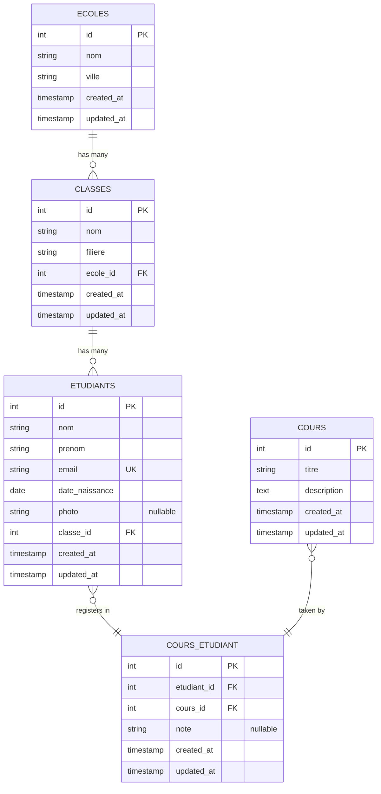
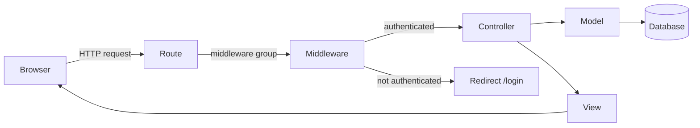

# 🏫 Laravel School Management — Exam Answer Sheet

<p align="center">
  
  
  
  
</p>

<p align="center">
  <b>Practice for the OFPPT Laravel exam.</b><br>
  For each question: <b>① cover the answer → ② write on paper → ③ uncover & check</b>
</p>

---

## 📖 Reference — Keep This Page Open

### Entity Relationship Diagram



### Architecture Flow



---

## ✍️ EXAM QUESTIONS — Write on Paper

---

### 1️⃣ Question 1: Create the Laravel Project

**Write these commands on your paper:**

```
$ ___________________________________________________________________

$ ___________________________________________________________________

$ ___________________________________________________________________

$ ___________________________________________________________________
```

<details>
<summary>✅ Click to check your answer</summary>

```bash
# Creates a new Laravel project called "school-app"
composer create-project --prefer-dist laravel/laravel school-app

# Move into the project
cd school-app

# Generate the app encryption key
php artisan key:generate

# Start the dev server at http://localhost:8000
php artisan serve
```

</details>

---

### 2️⃣ Question 2: Generate All Files with Artisan

**Write all 9 commands on your paper:**

```
// Models + migrations (4 commands)
$ ___________________________________________________________________

$ ___________________________________________________________________

$ ___________________________________________________________________

$ ___________________________________________________________________

// Pivot table migration
$ ___________________________________________________________________

// Controllers (2 commands)
$ ___________________________________________________________________

$ ___________________________________________________________________

// Middleware
$ ___________________________________________________________________

// Seeders (1 or 2 commands)
$ ___________________________________________________________________

$ ___________________________________________________________________
```

<details>
<summary>✅ Click to check your answer</summary>

```bash
# Models with their migration files
php artisan make:model Ecole -m
php artisan make:model Classe -m
php artisan make:model Etudiant -mcrf    # -mcrf = migration + controller + resource + factory
php artisan make:model Cours -m

# Pivot table (no model needed)
php artisan make:migration create_cours_etudiant_table

# Resource controllers
php artisan make:controller EcoleController --resource
php artisan make:controller CoursController --resource

# Middleware
php artisan make:middleware AuthMiddleware

# Seeders
php artisan make:seeder DatabaseSeeder
```

</details>

---

### 3️⃣ Question 3: Write the Migration for `ecoles`

**Write the full `up()` method on your paper:**

```
Schema::create('ecoles', function (Blueprint $table) {
    ___________________________________________________________________

    ___________________________________________________________________

    ___________________________________________________________________

    ___________________________________________________________________
});
```

<details>
<summary>✅ Click to check your answer</summary>

```php
Schema::create('ecoles', function (Blueprint $table) {
    $table->id();
    $table->string('nom');          // School name
    $table->string('ville');        // City
    $table->timestamps();           // created_at + updated_at
});
```

</details>

---

### 4️⃣ Question 4: Write the Migration for `classes`

**Write the full `up()` method on your paper:**

```
Schema::create('classes', function (Blueprint $table) {
    ___________________________________________________________________

    ___________________________________________________________________

    ___________________________________________________________________

    ___________________________________________________________________

    ___________________________________________________________________
});
```

<details>
<summary>✅ Click to check your answer</summary>

```php
Schema::create('classes', function (Blueprint $table) {
    $table->id();
    $table->string('nom');                                      // Class name (e.g. "2A")
    $table->string('filiere');                                  // Field (e.g. "DEVOWFS")
    $table->foreignId('ecole_id')->constrained('ecoles')        // FK → ecoles
          ->onDelete('cascade');                                // Delete classes if school is deleted
    $table->timestamps();
});
```

</details>

---

### 5️⃣ Question 5: Write the Migration for `etudiants`

**Write the full `up()` method on your paper:**

```
Schema::create('etudiants', function (Blueprint $table) {
    ___________________________________________________________________

    ___________________________________________________________________

    ___________________________________________________________________

    ___________________________________________________________________

    ___________________________________________________________________

    ___________________________________________________________________

    ___________________________________________________________________

    ___________________________________________________________________
});
```

<details>
<summary>✅ Click to check your answer</summary>

```php
Schema::create('etudiants', function (Blueprint $table) {
    $table->id();
    $table->string('nom');                                      // Last name
    $table->string('prenom');                                   // First name
    $table->string('email')->unique();                          // Email (must be unique)
    $table->date('date_naissance');                             // Birth date
    $table->string('photo')->nullable();                        // Photo path (optional)
    $table->foreignId('classe_id')->constrained('classes')      // FK → classes
          ->onDelete('cascade');
    $table->timestamps();
});
```

</details>

---

### 6️⃣ Question 6: Write the Migration for `cours`

**Write the full `up()` method on your paper:**

```
Schema::create('cours', function (Blueprint $table) {
    ___________________________________________________________________

    ___________________________________________________________________

    ___________________________________________________________________

    ___________________________________________________________________
});
```

<details>
<summary>✅ Click to check your answer</summary>

```php
Schema::create('cours', function (Blueprint $table) {
    $table->id();
    $table->string('titre');            // Course title
    $table->text('description');        // Course description
    $table->timestamps();
});
```

</details>

---

### 7️⃣ Question 7: Write the Pivot Table Migration

The pivot table `cours_etudiant` links students to courses (many-to-many). It also has a `note` column for grades.

**Write the full `up()` method on your paper:**

```
Schema::create('cours_etudiant', function (Blueprint $table) {
    ___________________________________________________________________

    ___________________________________________________________________

    ___________________________________________________________________

    ___________________________________________________________________

    ___________________________________________________________________

    ___________________________________________________________________
});
```

<details>
<summary>✅ Click to check your answer</summary>

```php
Schema::create('cours_etudiant', function (Blueprint $table) {
    $table->id();
    $table->foreignId('etudiant_id')->constrained('etudiants')  // FK → etudiants
          ->onDelete('cascade');
    $table->foreignId('cours_id')->constrained('cours')         // FK → cours
          ->onDelete('cascade');
    $table->string('note')->nullable();                         // Grade (e.g. "15/20")
    $table->timestamps();
});
```

</details>

**Don't forget:**
```bash
# Run all migrations after writing them
php artisan migrate
```

---

### 8️⃣ Question 8: Write the `Ecole` Model

**Write the full model with relationships on your paper:**

```php
<?php
namespace App\Models;

use Illuminate\Database\Eloquent\Model;

class Ecole extends Model
{
    protected $fillable = [__________________________________];

    // Relationship: one school has many classes
    public function classes()
    {
        return $this->______________________________________;
    }

    // Relationship: one school has many students through classes
    public function etudiants()
    {
        return $this->______________________________________;
    }
}
```

<details>
<summary>✅ Click to check your answer</summary>

```php
<?php
namespace App\Models;

use Illuminate\Database\Eloquent\Model;

class Ecole extends Model
{
    protected $fillable = ['nom', 'ville'];

    // One school HAS MANY classes
    public function classes()
    {
        return $this->hasMany(Classe::class);
        // Laravel looks for 'ecole_id' in the classes table
    }

    // One school HAS MANY students THROUGH classes (indirect)
    public function etudiants()
    {
        return $this->hasManyThrough(Etudiant::class, Classe::class);
        // Path: ecoles → classes → etudiants
    }
}
```

</details>

---

### 9️⃣ Question 9: Write the `Classe` Model

```php
<?php
namespace App\Models;

use Illuminate\Database\Eloquent\Model;

class Classe extends Model
{
    protected $fillable = [__________________________________];

    // A class belongs to one school
    public function ecole()
    {
        return $this->______________________________________;
    }

    // A class has many students
    public function etudiants()
    {
        return $this->______________________________________;
    }
}
```

<details>
<summary>✅ Click to check your answer</summary>

```php
<?php
namespace App\Models;

use Illuminate\Database\Eloquent\Model;

class Classe extends Model
{
    protected $fillable = ['nom', 'filiere', 'ecole_id'];

    // Inverse of hasMany: this class belongs to one school
    public function ecole()
    {
        return $this->belongsTo(Ecole::class);
    }

    // One class has many students
    public function etudiants()
    {
        return $this->hasMany(Etudiant::class);
    }
}
```

</details>

---

### 🔟 Question 10: Write the `Etudiant` Model

```php
<?php
namespace App\Models;

use Illuminate\Database\Eloquent\Model;

class Etudiant extends Model
{
    protected $fillable = [__________________________________];

    // A student belongs to one class
    public function classe()
    {
        return $this->______________________________________;
    }

    // A student belongs to many courses (many-to-many)
    public function cours()
    {
        return $this->______________________________________
                    ->______________________________________
                    ->______________________________________;
    }
}
```

<details>
<summary>✅ Click to check your answer</summary>

```php
<?php
namespace App\Models;

use Illuminate\Database\Eloquent\Model;

class Etudiant extends Model
{
    protected $fillable = ['nom', 'prenom', 'email', 'date_naissance', 'photo', 'classe_id'];

    // Inverse: this student belongs to one class
    public function classe()
    {
        return $this->belongsTo(Classe::class);
    }

    // Many-to-many: student belongs to many courses via pivot table
    public function cours()
    {
        return $this->belongsToMany(Cours::class, 'cours_etudiant')
                    ->withPivot('note')       // Also load the 'note' column
                    ->withTimestamps();       // Also load pivot timestamps
    }
}
```

</details>

---

### 1️⃣1️⃣ Question 11: Write the `Cours` Model

```php
<?php
namespace App\Models;

use Illuminate\Database\Eloquent\Model;

class Cours extends Model
{
    protected $fillable = [____________________];

    // A course belongs to many students
    public function etudiants()
    {
        return $this->________________________
                    ->________________________
                    ->________________________;
    }
}
```

<details>
<summary>✅ Click to check your answer</summary>

```php
<?php
namespace App\Models;

use Illuminate\Database\Eloquent\Model;

class Cours extends Model
{
    protected $fillable = ['titre', 'description'];

    // Inverse many-to-many: this course has many enrolled students
    public function etudiants()
    {
        return $this->belongsToMany(Etudiant::class, 'cours_etudiant')
                    ->withPivot('note')
                    ->withTimestamps();
    }
}
```

</details>

---

### 1️⃣2️⃣ Question 12: Write the Factory

**Write a factory that generates 20 fake students:**

```php
<?php
namespace Database\Factories;

use Illuminate\Database\Eloquent\Factories\Factory;

class EtudiantFactory extends Factory
{
    public function definition(): array
    {
        return [
            'nom'            => $this->faker->________________,
            'prenom'         => $this->faker->________________,
            'email'          => $this->faker->________________,
            'date_naissance' => $this->faker->________________,
            'photo'          => ______________________________,
            'classe_id'      => ______________________________,
        ];
    }
}
```

<details>
<summary>✅ Click to check your answer</summary>

```php
<?php
namespace Database\Factories;

use Illuminate\Database\Eloquent\Factories\Factory;

class EtudiantFactory extends Factory
{
    public function definition(): array
    {
        return [
            'nom'            => $this->faker->lastName(),
            'prenom'         => $this->faker->firstName(),
            'email'          => $this->faker->unique()->safeEmail(),
            'date_naissance' => $this->faker->date(),
            'photo'          => null,
            'classe_id'      => \App\Models\Classe::inRandomOrder()->first()->id,
        ];
    }
}
```

</details>

---

### 1️⃣3️⃣ Question 13: Write the Seeder

**Write a seeder that creates 2 schools, 2 classes, 2 courses, and 20 students:**

```php
<?php
namespace Database\Seeders;

use Illuminate\Database\Seeder;

class DatabaseSeeder extends Seeder
{
    public function run()
    {
        // Create 2 schools
        $ecole1 = \App\Models\Ecole::create([__________________________]);
        $ecole2 = \App\Models\Ecole::create([__________________________]);

        // Create classes linked to schools
        $classe1 = \App\Models\Classe::create([________________________]);
        $classe2 = \App\Models\Classe::create([________________________]);

        // Create courses
        \App\Models\Cours::create([____________________________________]);
        \App\Models\Cours::create([____________________________________]);

        // Generate 20 fake students
        ______________________________________________________________;
    }
}
```

<details>
<summary>✅ Click to check your answer</summary>

```php
<?php
namespace Database\Seeders;

use Illuminate\Database\Seeder;

class DatabaseSeeder extends Seeder
{
    public function run()
    {
        $ecole1 = \App\Models\Ecole::create(['nom' => 'ISTA MAAMOURA', 'ville' => 'Kenitra']);
        $ecole2 = \App\Models\Ecole::create(['nom' => 'ISTA SALE',     'ville' => 'Sale']);

        $classe1 = \App\Models\Classe::create(['nom' => '2A', 'filiere' => 'DEVOWFS', 'ecole_id' => $ecole1->id]);
        $classe2 = \App\Models\Classe::create(['nom' => '2B', 'filiere' => 'DEVOWFS', 'ecole_id' => $ecole2->id]);

        \App\Models\Cours::create(['titre' => 'Laravel', 'description' => 'Framework PHP']);
        \App\Models\Cours::create(['titre' => 'MySQL',   'description' => 'Base de données']);

        \App\Models\Etudiant::factory(20)->create();
    }
}
```

```bash
php artisan db:seed
```

</details>

---

### 1️⃣4️⃣ Question 14: Write the Middleware

**Write a custom auth middleware that redirects unauthenticated users:**

```php
<?php
namespace App\Http\Middleware;

use Closure;
use Illuminate\Http\Request;

class AuthMiddleware
{
    public function handle(Request $request, Closure $next)
    {
        if (___________________________________________________________) {
            return ___________________________________________________;
        }

        return _______________________________________________________;
    }
}
```

**Then write how to register it in `app/Http/Kernel.php`:**

```php
protected $routeMiddleware = [
    // ...
    '_______________' => \_______________________________::class,
];
```

<details>
<summary>✅ Click to check your answer</summary>

```php
<?php
namespace App\Http\Middleware;

use Closure;
use Illuminate\Http\Request;

class AuthMiddleware
{
    public function handle(Request $request, Closure $next)
    {
        // If user is NOT logged in, redirect to login page
        if (!session()->has('user_id')) {
            return redirect('/login');
        }

        // Otherwise, let the request continue to the controller
        return $next($request);
    }
}
```

**In `app/Http/Kernel.php`:**
```php
protected $routeMiddleware = [
    // ...
    'auth.custom' => \App\Http\Middleware\AuthMiddleware::class,
];
```

</details>

---

### 1️⃣5️⃣ Question 15: Write the Routes

**Write all routes in `routes/web.php` — public redirect + protected resource routes:**

```php
<?php
use Illuminate\Support\Facades\Route;
use App\Http\Controllers\________________;
use App\Http\Controllers\________________;
use App\Http\Controllers\________________;

// Public: redirect / to students list
Route::get('/', function () {
    return redirect()->route('_______________');
});

// Protected group
Route::middleware(['_______________'])->group(function () {

    Route::resource('_______________', ________________________);

    Route::resource('_______________', ________________________);

    Route::resource('_______________', ________________________);
});
```

<details>
<summary>✅ Click to check your answer</summary>

```php
<?php
use Illuminate\Support\Facades\Route;
use App\Http\Controllers\EtudiantController;
use App\Http\Controllers\EcoleController;
use App\Http\Controllers\CoursController;

// Homepage redirects to students list
Route::get('/', function () {
    return redirect()->route('etudiants.index');
});

// All routes below require authentication
Route::middleware(['auth.custom'])->group(function () {

    Route::resource('etudiants', EtudiantController::class);
    Route::resource('ecoles', EcoleController::class);
    Route::resource('cours', CoursController::class);

});
```

> `Route::resource()` generates 7 routes automatically:
> - `GET /etudiants` → `index()` (list)
> - `GET /etudiants/create` → `create()` (form)
> - `POST /etudiants` → `store()` (save)
> - `GET /etudiants/{id}` → `show()` (detail)
> - `GET /etudiants/{id}/edit` → `edit()` (edit form)
> - `PUT /etudiants/{id}` → `update()` (save changes)
> - `DELETE /etudiants/{id}` → `destroy()` (delete)

</details>

---

### 1️⃣6️⃣ Question 16: Write the Controller Constructor

**Protect all methods EXCEPT `index`:**

```php
public function __construct()
{
    $this->middleware('_______________')->except([_______________]);
}
```

<details>
<summary>✅ Click to check your answer</summary>

```php
public function __construct()
{
    $this->middleware('auth.custom')->except(['index']);
}
```

</details>

---

### 1️⃣7️⃣ Question 17: Write the `index()` Method

**List all students with their class and courses, paginated 10 per page:**

```php
public function index()
{
    $etudiants = ______________________________________________________;

    return view('_______________', compact('_______________'));
}
```

<details>
<summary>✅ Click to check your answer</summary>

```php
public function index()
{
    $etudiants = Etudiant::with(['classe', 'cours'])->paginate(10);

    return view('etudiants.index', compact('etudiants'));
}
```

</details>

---

### 1️⃣8️⃣ Question 18: Write the `create()` Method

**Show the form with all classes and courses for dropdowns:**

```php
public function create()
{
    $classes = ________________;
    $cours   = ________________;

    return view('_______________', compact('_______________', '_______________'));
}
```

<details>
<summary>✅ Click to check your answer</summary>

```php
public function create()
{
    $classes = Classe::all();
    $cours   = Cours::all();

    return view('etudiants.create', compact('classes', 'cours'));
}
```

</details>

---

### 1️⃣9️⃣ Question 19: Write the `store()` Method — Full Version

**Validate, upload image, create student, attach courses:**

```php
public function store(Request $request)
{
    // Validation
    $request->validate([
        'nom'            => '_______________',
        'prenom'         => '_______________',
        'email'          => '_______________',
        'date_naissance' => '_______________',
        'classe_id'      => '_______________',
        'photo'          => '_______________',
    ]);

    // Upload photo
    $photoPath = null;
    if ($request->hasFile('photo')) {
        $photoPath = $request->file('photo')->store('_______________', '_______________');
    }

    // Create student
    $etudiant = Etudiant::create([_____________________________]);

    // Attach courses (many-to-many)
    if ($request->has('_______________')) {
        $etudiant->_______________->_______________($request->_______________);
    }

    return redirect()->route('_______________');
}
```

<details>
<summary>✅ Click to check your answer</summary>

```php
public function store(Request $request)
{
    $request->validate([
        'nom'            => 'required',
        'prenom'         => 'required',
        'email'          => 'required|email|unique:etudiants',
        'date_naissance' => 'required|date',
        'classe_id'      => 'required',
        'photo'          => 'nullable|image|mimes:jpeg,png,jpg|max:2048',
    ]);

    // Handle image upload
    $photoPath = null;
    if ($request->hasFile('photo')) {
        $photoPath = $request->file('photo')->store('photos', 'public');
    }

    // Create student
    $etudiant = Etudiant::create([
        'nom'            => $request->nom,
        'prenom'         => $request->prenom,
        'email'          => $request->email,
        'date_naissance' => $request->date_naissance,
        'classe_id'      => $request->classe_id,
        'photo'          => $photoPath,
    ]);

    // Attach courses to pivot table
    if ($request->has('cours')) {
        $etudiant->cours()->attach($request->cours);
    }

    return redirect()->route('etudiants.index');
}
```

</details>

---

### 2️⃣0️⃣ Question 20: Write the `show()` Method

**Show one student with class, school, and courses:**

```php
public function show($id)
{
    $etudiant = Etudiant::with([________________________])->findOrFail($id);

    return view('_______________', compact('_______________'));
}
```

<details>
<summary>✅ Click to check your answer</summary>

```php
public function show($id)
{
    $etudiant = Etudiant::with(['classe.ecole', 'cours'])->findOrFail($id);

    return view('etudiants.show', compact('etudiant'));
}
```

</details>

---

### 2️⃣1️⃣ Question 21: Write the `edit()` Method

**Show edit form with pre-selected courses:**

```php
public function edit($id)
{
    $etudiant      = Etudiant::findOrFail($id);
    $classes       = ________________;
    $cours         = ________________;
    $selectedCours = $etudiant->cours->pluck('_______________')->toArray();

    return view('_______________', compact('_______________', '_______________', '_______________', '_______________'));
}
```

<details>
<summary>✅ Click to check your answer</summary>

```php
public function edit($id)
{
    $etudiant      = Etudiant::findOrFail($id);
    $classes       = Classe::all();
    $cours         = Cours::all();
    $selectedCours = $etudiant->cours->pluck('id')->toArray();

    return view('etudiants.edit', compact('etudiant', 'classes', 'cours', 'selectedCours'));
}
```

</details>

---

### 2️⃣2️⃣ Question 22: Write the `update()` Method

**Update student with photo replacement + course sync:**

```php
public function update(Request $request, $id)
{
    // Validation (email ignores current student's email)
    $request->validate([
        'nom'            => '_______________',
        'prenom'         => '_______________',
        'email'          => '_______________',
        'date_naissance' => '_______________',
        'classe_id'      => '_______________',
        'photo'          => '_______________',
    ]);

    $etudiant = Etudiant::findOrFail($id);

    // Replace photo if new one uploaded
    if ($request->hasFile('photo')) {
        \Storage::disk('_______________')->delete($etudiant->_______________);
        $etudiant->_______________ = $request->file('_______________')->store('_______________', '_______________');
    }

    // Update fields
    $etudiant->_______________ = $request->_______________;
    $etudiant->_______________ = $request->_______________;
    $etudiant->_______________ = $request->_______________;
    $etudiant->_______________ = $request->_______________;
    $etudiant->_______________ = $request->_______________;
    $etudiant->save();

    // Sync courses (replaces all pivot records)
    $etudiant->_______________->_______________($request->_______________ ?? []);

    return redirect()->route('_______________');
}
```

<details>
<summary>✅ Click to check your answer</summary>

```php
public function update(Request $request, $id)
{
    $request->validate([
        'nom'            => 'required',
        'prenom'         => 'required',
        'email'          => 'required|email|unique:etudiants,email,' . $id,
        'date_naissance' => 'required|date',
        'classe_id'      => 'required',
        'photo'          => 'nullable|image|mimes:jpeg,png,jpg|max:2048',
    ]);

    $etudiant = Etudiant::findOrFail($id);

    // Replace photo
    if ($request->hasFile('photo')) {
        \Storage::disk('public')->delete($etudiant->photo);
        $etudiant->photo = $request->file('photo')->store('photos', 'public');
    }

    // Update each field
    $etudiant->nom            = $request->nom;
    $etudiant->prenom         = $request->prenom;
    $etudiant->email          = $request->email;
    $etudiant->date_naissance = $request->date_naissance;
    $etudiant->classe_id      = $request->classe_id;
    $etudiant->save();

    // Sync: add new, remove unchecked, keep existing
    $etudiant->cours()->sync($request->cours ?? []);

    return redirect()->route('etudiants.index');
}
```

</details>

---

### 2️⃣3️⃣ Question 23: Write the `destroy()` Method

**Delete student, their photo, and their pivot records:**

```php
public function destroy($id)
{
    $etudiant = Etudiant::findOrFail($id);

    // Delete photo file
    if ($etudiant->_______________) {
        \Storage::disk('_______________')->delete($etudiant->_______________);
    }

    // Remove pivot table records
    $etudiant->_______________->_______________();

    // Delete student
    $etudiant->_______________();

    return redirect()->route('_______________');
}
```

<details>
<summary>✅ Click to check your answer</summary>

```php
public function destroy($id)
{
    $etudiant = Etudiant::findOrFail($id);

    // Delete photo from storage
    if ($etudiant->photo) {
        \Storage::disk('public')->delete($etudiant->photo);
    }

    // Detach all courses from pivot table
    $etudiant->cours()->detach();

    // Delete the student
    $etudiant->delete();

    return redirect()->route('etudiants.index');
}
```

</details>

---

### 2️⃣4️⃣ Question 24: Write the Layout View

**Write `layouts/app.blade.php`:**

```html
<!DOCTYPE html>
<html>
<head>
    <title>_______________</title>
</head>
<body>
    <nav>
        <a href="{{ route('_______________') }}">_______________</a> |
        <a href="{{ route('_______________') }}">_______________</a> |
        <a href="{{ route('_______________') }}">_______________</a>
    </nav>
    <hr>
    @_______________('_______________')
</body>
</html>
```

<details>
<summary>✅ Click to check your answer</summary>

```html
<!DOCTYPE html>
<html>
<head>
    <title>School App</title>
</head>
<body>
    <nav>
        <a href="{{ route('etudiants.index') }}">Etudiants</a> |
        <a href="{{ route('ecoles.index') }}">Ecoles</a> |
        <a href="{{ route('cours.index') }}">Cours</a>
    </nav>
    <hr>
    @yield('content')
</body>
</html>
```

</details>

---

### 2️⃣5️⃣ Question 25: Write the Index View

The main students list page with photo, class, school, courses, and actions.

**Fill in the blanks in `etudiants/index.blade.php`:**

```html
@extends('_______________')

@section('_______________')
    <h1>Liste des Etudiants</h1>
    <a href="{{ route('_______________') }}">Ajouter un Etudiant</a>

    <table border="1">
        <tr>
            <th>Photo</th>
            <th>Nom</th>
            <th>Prénom</th>
            <th>Email</th>
            <th>Classe</th>
            <th>Ecole</th>
            <th>Cours</th>
            <th>Actions</th>
        </tr>

        @_______________($etudiants as $e)
        <tr>
            <td>
                @if($e->_______________)
                    _______________) }}" width="60">
                @else
                    Aucune photo
                @endif
            </td>
            <td>{{ $e->_______________ }}</td>
            <td>{{ $e->_______________ }}</td>
            <td>{{ $e->_______________ }}</td>
            <td>{{ $e->_______________->_______________ }}</td>
            <td>{{ $e->_______________->_______________->_______________ }}</td>
            <td>
                @_______________($e->_______________ as $c)
                    {{ $c->_______________ }} ({{ $c->_______________->_______________ ?? 'N/A' }}),
                @_______________
            </td>
            <td>
                <a href="{{ route('_______________', $e->id) }}">Voir</a>
                <a href="{{ route('_______________', $e->id) }}">Modifier</a>
                <form action="{{ route('_______________', $e->id) }}" method="POST">
                    @_______________
                    @_______________('_______________')
                    <button type="submit">Supprimer</button>
                </form>
            </td>
        </tr>
        @_______________

        {{ $etudiants->_______________() }}
    @_______________
```

<details>
<summary>✅ Click to check your answer</summary>

```html
@extends('layouts.app')

@section('content')
    <h1>Liste des Etudiants</h1>
    <a href="{{ route('etudiants.create') }}">Ajouter un Etudiant</a>

    <table border="1">
        <tr>
            <th>Photo</th>
            <th>Nom</th>
            <th>Prénom</th>
            <th>Email</th>
            <th>Classe</th>
            <th>Ecole</th>
            <th>Cours</th>
            <th>Actions</th>
        </tr>

        @foreach($etudiants as $e)
        <tr>
            <td>
                @if($e->photo)
                    photo) }}" width="60">
                @else
                    Aucune photo
                @endif
            </td>
            <td>{{ $e->nom }}</td>
            <td>{{ $e->prenom }}</td>
            <td>{{ $e->email }}</td>
            <td>{{ $e->classe->nom }}</td>
            <td>{{ $e->classe->ecole->nom }}</td>
            <td>
                @foreach($e->cours as $c)
                    {{ $c->titre }} ({{ $c->pivot->note ?? 'N/A' }}),
                @endforeach
            </td>
            <td>
                <a href="{{ route('etudiants.show', $e->id) }}">Voir</a>
                <a href="{{ route('etudiants.edit', $e->id) }}">Modifier</a>
                <form action="{{ route('etudiants.destroy', $e->id) }}" method="POST">
                    @csrf
                    @method('DELETE')
                    <button type="submit">Supprimer</button>
                </form>
            </td>
        </tr>
        @endforeach
    </table>

    {{ $etudiants->links() }}
@endsection
```

</details>

---

### 2️⃣6️⃣ Question 26: Write the Create View

**Fill in the blanks in `etudiants/create.blade.php`:**

```html
@extends('_______________')

@section('_______________')
    <h1>Ajouter un Etudiant</h1>

    <form action="{{ route('_______________') }}" method="POST"
          enctype="_______________">
        @_______________

        <label>Nom</label>
        <input type="text" name="_______________">

        <label>Prénom</label>
        <input type="text" name="_______________">

        <label>Email</label>
        <input type="_______________" name="_______________">

        <label>Date de naissance</label>
        <input type="_______________" name="_______________">

        <label>Photo</label>
        <input type="_______________" name="_______________">

        <label>Classe</label>
        <select name="_______________">
            @_______________($classes as $classe)
                <option value="{{ $classe->_______________ }}">
                    {{ $classe->_______________ }} - {{ $classe->_______________->_______________ }}
                </option>
            @_______________
        </select>

        <label>Cours</label>
        <select name="_______________" _______________>
            @_______________($cours as $c)
                <option value="{{ $c->_______________ }}">{{ $c->_______________ }}</option>
            @_______________
        </select>

        <button type="submit">_______________</button>
        <a href="{{ route('_______________') }}">Retour</a>
    </form>
@_______________
```

<details>
<summary>✅ Click to check your answer</summary>

```html
@extends('layouts.app')

@section('content')
    <h1>Ajouter un Etudiant</h1>

    <form action="{{ route('etudiants.store') }}" method="POST"
          enctype="multipart/form-data">
        @csrf

        <label>Nom</label>
        <input type="text" name="nom">

        <label>Prénom</label>
        <input type="text" name="prenom">

        <label>Email</label>
        <input type="email" name="email">

        <label>Date de naissance</label>
        <input type="date" name="date_naissance">

        <label>Photo</label>
        <input type="file" name="photo">

        <label>Classe</label>
        <select name="classe_id">
            @foreach($classes as $classe)
                <option value="{{ $classe->id }}">
                    {{ $classe->nom }} - {{ $classe->ecole->nom }}
                </option>
            @endforeach
        </select>

        <label>Cours</label>
        <select name="cours[]" multiple>
            @foreach($cours as $c)
                <option value="{{ $c->id }}">{{ $c->titre }}</option>
            @endforeach
        </select>

        <button type="submit">Enregistrer</button>
        <a href="{{ route('etudiants.index') }}">Retour</a>
    </form>
@endsection
```

</details>

---

### 2️⃣7️⃣ Question 27: Write the Edit View

**Fill in the blanks in `etudiants/edit.blade.php`:**

```html
@extends('_______________')

@section('_______________')
    <h1>Modifier l'Etudiant</h1>

    <form action="{{ route('_______________', $etudiant->id) }}"
          method="POST" enctype="_______________">
        @_______________
        @_______________('_______________')

        <label>Nom</label>
        <input type="text" name="_______________" value="{{ $etudiant->_______________ }}">

        <label>Prénom</label>
        <input type="text" name="_______________" value="{{ $etudiant->_______________ }}">

        <label>Email</label>
        <input type="_______________" name="_______________" value="{{ $etudiant->_______________ }}">

        <label>Date de naissance</label>
        <input type="_______________" name="_______________" value="{{ $etudiant->_______________ }}">

        @if($etudiant->_______________)
            _______________) }}" width="80"><br>
        @endif
        <label>Nouvelle photo (optionnel)</label>
        <input type="_______________" name="_______________">

        <label>Classe</label>
        <select name="_______________">
            @_______________($classes as $classe)
                <option value="{{ $classe->_______________ }}"
                    {{ $etudiant->_______________ == $classe->_______________ ? '_______________' : '' }}>
                    {{ $classe->_______________ }}
                </option>
            @_______________
        </select>

        <label>Cours</label>
        <select name="_______________" multiple>
            @_______________($cours as $c)
                <option value="{{ $c->_______________ }}"
                    {{ in_array($c->_______________, $_______________) ? '_______________' : '' }}>
                    {{ $c->_______________ }}
                </option>
            @_______________
        </select>

        <button type="submit">_______________</button>
        <a href="{{ route('_______________') }}">Retour</a>
    </form>
@_______________
```

<details>
<summary>✅ Click to check your answer</summary>

```html
@extends('layouts.app')

@section('content')
    <h1>Modifier l'Etudiant</h1>

    <form action="{{ route('etudiants.update', $etudiant->id) }}"
          method="POST" enctype="multipart/form-data">
        @csrf
        @method('PUT')

        <label>Nom</label>
        <input type="text" name="nom" value="{{ $etudiant->nom }}">

        <label>Prénom</label>
        <input type="text" name="prenom" value="{{ $etudiant->prenom }}">

        <label>Email</label>
        <input type="email" name="email" value="{{ $etudiant->email }}">

        <label>Date de naissance</label>
        <input type="date" name="date_naissance" value="{{ $etudiant->date_naissance }}">

        @if($etudiant->photo)
            photo) }}" width="80"><br>
        @endif
        <label>Nouvelle photo (optionnel)</label>
        <input type="file" name="photo">

        <label>Classe</label>
        <select name="classe_id">
            @foreach($classes as $classe)
                <option value="{{ $classe->id }}"
                    {{ $etudiant->classe_id == $classe->id ? 'selected' : '' }}>
                    {{ $classe->nom }}
                </option>
            @endforeach
        </select>

        <label>Cours</label>
        <select name="cours[]" multiple>
            @foreach($cours as $c)
                <option value="{{ $c->id }}"
                    {{ in_array($c->id, $selectedCours) ? 'selected' : '' }}>
                    {{ $c->titre }}
                </option>
            @endforeach
        </select>

        <button type="submit">Mettre à jour</button>
        <a href="{{ route('etudiants.index') }}">Retour</a>
    </form>
@endsection
```

</details>

---

### 2️⃣8️⃣ Question 28: Write the Show View

**Fill in the blanks in `etudiants/show.blade.php`:**

```html
@extends('_______________')

@section('_______________')
    <h1>Détails de l'Etudiant</h1>

    @if($etudiant->_______________)
        _______________) }}" width="120">
    @endif

    <p>Nom : {{ $etudiant->_______________ }}</p>
    <p>Prénom : {{ $etudiant->_______________ }}</p>
    <p>Email : {{ $etudiant->_______________ }}</p>
    <p>Date de naissance : {{ $etudiant->_______________ }}</p>
    <p>Classe : {{ $etudiant->_______________->_______________ }}</p>
    <p>Ecole : {{ $etudiant->_______________->_______________->_______________ }}
         — {{ $etudiant->_______________->_______________->_______________ }}</p>

    <h3>Cours inscrits :</h3>
    <ul>
        @_______________($etudiant->_______________ as $c)
            <li>{{ $c->_______________ }}
                — Note: {{ $c->_______________->_______________ ?? 'Non notée' }}</li>
        @_______________
    </ul>

    <a href="{{ route('_______________', $etudiant->id) }}">Modifier</a>
    <a href="{{ route('_______________') }}">Retour</a>
@_______________
```

<details>
<summary>✅ Click to check your answer</summary>

```html
@extends('layouts.app')

@section('content')
    <h1>Détails de l'Etudiant</h1>

    @if($etudiant->photo)
        photo) }}" width="120">
    @endif

    <p>Nom : {{ $etudiant->nom }}</p>
    <p>Prénom : {{ $etudiant->prenom }}</p>
    <p>Email : {{ $etudiant->email }}</p>
    <p>Date de naissance : {{ $etudiant->date_naissance }}</p>
    <p>Classe : {{ $etudiant->classe->nom }}</p>
    <p>Ecole : {{ $etudiant->classe->ecole->nom }}
         — {{ $etudiant->classe->ecole->ville }}</p>

    <h3>Cours inscrits :</h3>
    <ul>
        @foreach($etudiant->cours as $c)
            <li>{{ $c->titre }}
                — Note: {{ $c->pivot->note ?? 'Non notée' }}</li>
        @endforeach
    </ul>

    <a href="{{ route('etudiants.edit', $etudiant->id) }}">Modifier</a>
    <a href="{{ route('etudiants.index') }}">Retour</a>
@endsection
```

</details>

---

### 2️⃣9️⃣ Question 29: Write the Eloquent Queries (Exam Questions)

**Write the query for each question:**

```php
// 1. Get all students of school "ISTA MAAMOURA"
$etudiants = ___________________________________________________________;

// 2. Find the school with the most students
$ecole = _______________________________________________________________;

// 3. Get students enrolled in at least one course
$etudiants = ___________________________________________________________;

// 4. Get all students with their course count
$etudiants = ___________________________________________________________;

// 5. Get all courses of student with ID 1
$cours = ________________________________________________________________;

// 6. Loop through courses and show title + grade
foreach (________________________________ as $c) {
    echo $c->_______________ . ' - ' . $c->_______________->_______________;
}

// 7. Enroll student 1 in course with ID 2 with grade "15/20"
Etudiant::find(1)->_______________->_______________(____________________);

// 8. Remove student 1 from course ID 2
Etudiant::find(1)->_______________->_______________(____________________);

// 9. Replace all courses of student 1 with courses 1, 2, 3
Etudiant::find(1)->_______________->_______________([__________________]);
```

<details>
<summary>✅ Click to check your answer</summary>

```php
// 1. All students of a specific school (via hasManyThrough)
$etudiants = Ecole::where('nom', 'ISTA MAAMOURA')->first()->etudiants;

// 2. School with most students
$ecole = Ecole::withCount('etudiants')->orderBy('etudiants_count', 'desc')->first();

// 3. Students with at least one course
$etudiants = Etudiant::has('cours')->get();

// 4. Students with course count
$etudiants = Etudiant::withCount('cours')->get();

// 5. All courses of student 1
$cours = Etudiant::find(1)->cours;

// 6. Loop with pivot data
foreach (Etudiant::find(1)->cours as $c) {
    echo $c->titre . ' - ' . $c->pivot->note;
}

// 7. Attach (enroll)
Etudiant::find(1)->cours()->attach($coursId, ['note' => '15/20']);

// 8. Detach (unenroll)
Etudiant::find(1)->cours()->detach($coursId);

// 9. Sync (replace all)
Etudiant::find(1)->cours()->sync([1, 2, 3]);
```

</details>

---

### 3️⃣0️⃣ Question 30: Final Checklist — Quick Write

**Without looking, write the essential code for each exam topic:**

| # | Concept | Write the code |
|---|---------|----------------|
| 1 | Create project | `___________________________________________` |
| 2 | Model + migration | `___________________________________________` |
| 3 | Resource controller | `___________________________________________` |
| 4 | Foreign key column | `___________________________________________` |
| 5 | Mass assignment | `___________________________________________` |
| 6 | 1-to-many (parent) | `__________________` |
| 7 | 1-to-many (child) | `__________________` |
| 8 | Many-to-many | `__________________` |
| 9 | Run all migrations | `__________________` |
| 10 | Seed database | `__________________` |
| 11 | Storage link | `__________________` |
| 12 | Image form attr | `__________________` |
| 13 | Store uploaded file | `___________________________________________` |
| 14 | Display image | `___________________________________________` |
| 15 | Update form methods | `__________________` + `__________________` |
| 16 | Delete form methods | `__________________` + `__________________` |
| 17 | Paginate | `__________________` + `__________________` |
| 18 | Validate | `___________________________________________` |
| 19 | Middleware register | `___________________________________________` |
| 20 | Resource route | `___________________________________________` |
| 21 | Named redirect | `___________________________________________` |

<details>
<summary>✅ Click to check your answers</summary>

| # | Concept | Code |
|---|---------|------|
| 1 | Create project | `composer create-project --prefer-dist laravel/laravel school-app` |
| 2 | Model + migration | `php artisan make:model X -m` |
| 3 | Resource controller | `php artisan make:controller XController --resource` |
| 4 | Foreign key | `$table->foreignId('x_id')->constrained('xs')` |
| 5 | Mass assignment | `protected $fillable = ['col1', 'col2']` |
| 6 | 1-to-many (parent) | `$this->hasMany(X::class)` |
| 7 | 1-to-many (child) | `$this->belongsTo(X::class)` |
| 8 | Many-to-many | `$this->belongsToMany(X::class, 'pivot_table')` |
| 9 | Run migrations | `php artisan migrate` |
| 10 | Seed database | `php artisan db:seed` |
| 11 | Storage link | `php artisan storage:link` |
| 12 | Image form attr | `enctype="multipart/form-data"` |
| 13 | Store file | `$request->file('x')->store('folder', 'public')` |
| 14 | Display image | `asset('storage/' . $model->photo)` |
| 15 | Update form | `@method('PUT')` + `@csrf` |
| 16 | Delete form | `@method('DELETE')` + `@csrf` |
| 17 | Paginate | `paginate(10)` + `{{ $items->links() }}` |
| 18 | Validate | `$request->validate([...])` |
| 19 | Middleware register | `'auth.custom' => \App\Http\Middleware\AuthMiddleware::class` |
| 20 | Resource route | `Route::resource('x', XController::class)` |
| 21 | Named redirect | `redirect()->route('x.index')` |

</details>

---

### 🎯 How to Practice

1. **Print** this page or keep it open on your screen
2. **Cover** the answer (click the dropdown to hide it)
3. **Write** your answer on paper using the blank spaces
4. **Uncover** and check
5. **Repeat** until you can write every answer without looking

Good luck on your exam! 🍀
