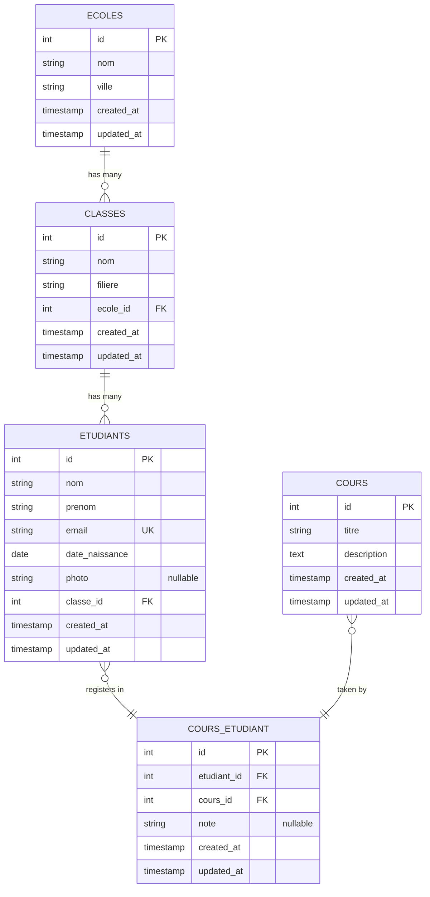
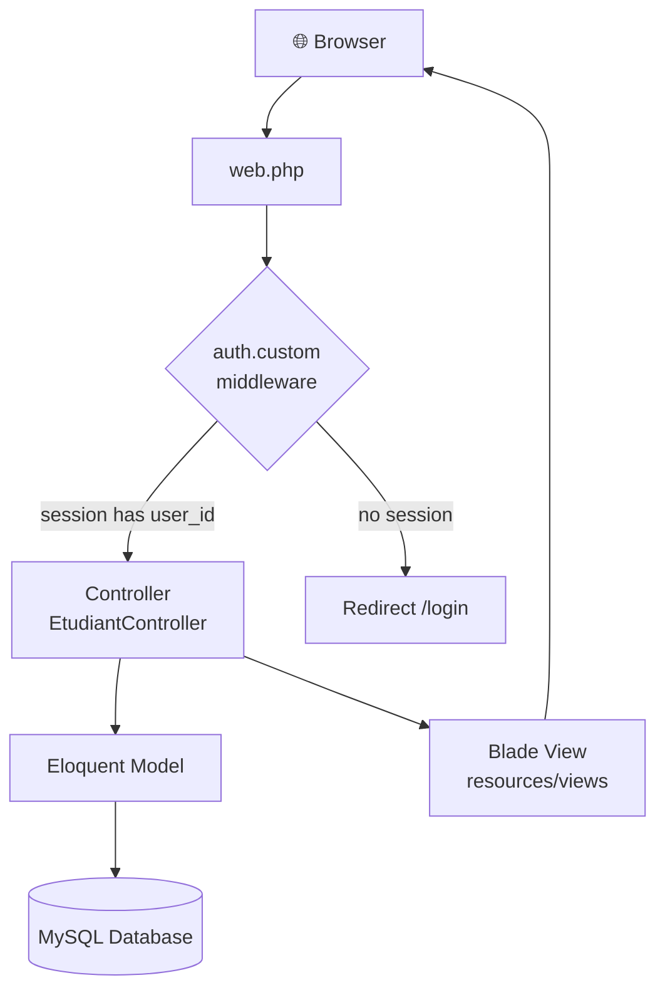

# Laravel School Management — Complete Course

<p align="center">
  
  
  
  
  
</p>

<p align="center">
  <b>App:</b> School Management <code>Ecole → Classe → Etudiant ↔ Cours</code><br>
  <b>One complete project covering the full OFPPT Laravel course — from zero to deployed CRUD.</b>
</p>

---

## 📋 Table of Contents

| # | Step | Topic |
|---|------|-------|
| 1 | [🛠️ Step 1 — Create the Project](#-step-1--create-the-project) | `composer create-project` |
| 2 | [⚡ Step 2 — Artisan Commands](#-step-2--artisan-commands) | Models, migrations, controllers, middleware |
| 3 | [🗄️ Step 3 — Migrations](#-step-3--migrations) | DB schema for all 5 tables |
| 4 | [🤖 Step 4 — Models](#-step-4--models) | Eloquent relationships (hasMany, belongsTo, belongsToMany) |
| 5 | [🏭 Step 5 — Factory](#-step-5--factory) | Fake data generator |
| 6 | [🌱 Step 6 — Seeder](#-step-6--seeder) | Seed schools, classes, courses + 20 students |
| 7 | [🔒 Step 7 — Middleware](#-step-7--middleware) | Custom auth middleware |
| 8 | [🛣️ Step 8 — Routes](#-step-8--routes) | Resource routes + middleware group |
| 9 | [🎮 Step 9 — Controller](#-step-9--controller) | Full CRUD with image upload + pivot sync |
| 10 | [🎨 Step 10 — Blade Views](#-step-10--blade-views) | Layout, index, create, edit, show |
| 11 | [📊 Step 11 — Eloquent Queries](#-step-11--eloquent-queries-exam-style) | Exam-style query examples |
| | [✅ Final Checklist](#-final-checklist--before-writing-in-the-exam) | Cram sheet for the exam |

---

## 📖 Overview

This repository is a **step-by-step Laravel tutorial** that builds a complete **School Management System**. It covers every topic in the OFPPT Laravel curriculum:

| Concept | What you'll learn |
|---------|------------------|
| **1-to-many** | School → Classes → Students |
| **Many-to-many** | Students ↔ Courses (with pivot table + notes) |
| **CRUD** | Full Create-Read-Update-Delete with image upload |
| **Validation** | Server-side `$request->validate()` rules |
| **Middleware** | Custom auth guard protecting routes |
| **Factories & Seeders** | Generate fake data for testing |
| **Eloquent** | `hasMany`, `belongsTo`, `belongsToMany`, `hasManyThrough`, `withCount`, `sync` |

---

## 🗺️ Entity Relationship Diagram



---

## 🔄 Architecture Flow



---

## 🛠️ Step 1 — Create the Project

Creates a fresh Laravel project, generates the app encryption key, and starts the dev server.

```bash
# Creates a brand new Laravel project called "school-app" with all dependencies
composer create-project --prefer-dist laravel/laravel school-app

# Move into the project directory so all following commands run inside it
cd school-app

# Generates a unique APP_KEY in the .env file (Laravel uses it for encryption, sessions, etc.)
php artisan key:generate

# Starts a local development server at http://localhost:8000
php artisan serve
```

---

## ⚡ Step 2 — Artisan Commands

Artisan is Laravel's CLI tool. Each command below generates files automatically so you don't write them by hand.

### Models + Migrations

```bash
# Creates Ecole model + a migration file for the "ecoles" table
php artisan make:model Ecole -m

# Creates Classe model + migration for the "classes" table
php artisan make:model Classe -m

# Creates Etudiant model + migration + controller + resource routes + factory (all at once!)
php artisan make:model Etudiant -mcrf

# Creates Cours model + migration for the "cours" table
php artisan make:model Cours -m
```

### Pivot Table (no model needed)

```bash
# Creates a migration for the pivot table "cours_etudiant" (links students to courses)
php artisan make:migration create_cours_etudiant_table
```

### Controllers

```bash
# Creates a controller with all 7 CRUD methods (index, create, store, show, edit, update, destroy)
php artisan make:controller EcoleController --resource

# Same for courses
php artisan make:controller CoursController --resource
```

### Middleware

```bash
# Creates a custom middleware class that runs before a request reaches the controller
php artisan make:middleware AuthMiddleware
```

### Seeder + Factory

```bash
# Creates a seeder class specifically for filling the etudiants table with test data
php artisan make:seeder EtudiantSeeder

# Creates the main seeder that will call all other seeders
php artisan make:seeder DatabaseSeeder
```

---

## 🗄️ Step 3 — Migrations

Migrations are like a **version control for your database**. Each `up()` method defines a table schema. Run them in order.

### `ecoles`

Stores all schools. Has no foreign keys (it's the top-level parent).

```php
// database/migrations/xxxx_create_ecoles_table.php
public function up()
{
    Schema::create('ecoles', function (Blueprint $table) {
        $table->id();                 // Auto-increment primary key
        $table->string('nom');        // School name (e.g., "ISTA MAAMOURA")
        $table->string('ville');      // City where school is located
        $table->timestamps();         // created_at + updated_at columns
    });
}
```

### `classes`

Each class belongs to one school. The `ecole_id` foreign key creates the 1-to-many link.

```php
public function up()
{
    Schema::create('classes', function (Blueprint $table) {
        $table->id();
        $table->string('nom');                                     // Class name (e.g., "2A")
        $table->string('filiere');                                 // Field of study (e.g., "DEVOWFS")
        $table->foreignId('ecole_id')->constrained('ecoles')->onDelete('cascade');
            // foreignId() creates an unsigned big integer column
            // constrained() links it to the "id" column of the "ecoles" table
            // onDelete('cascade') means: if a school is deleted, all its classes are deleted too
        $table->timestamps();
    });
}
```

### `etudiants`

Each student belongs to one class. Also has a nullable photo column for image uploads.

```php
public function up()
{
    Schema::create('etudiants', function (Blueprint $table) {
        $table->id();
        $table->string('nom');                                     // Last name
        $table->string('prenom');                                  // First name
        $table->string('email')->unique();                         // Email (must be unique)
        $table->date('date_naissance');                            // Birth date
        $table->string('photo')->nullable();                       // Profile photo path (optional)
        $table->foreignId('classe_id')->constrained('classes')->onDelete('cascade');
            // Links each student to a class
        $table->timestamps();
    });
}
```

### `cours`

Stores available courses. No foreign keys (courses are independent entities).

```php
public function up()
{
    Schema::create('cours', function (Blueprint $table) {
        $table->id();
        $table->string('titre');          // Course title (e.g., "Laravel")
        $table->text('description');      // Course description (long text)
        $table->timestamps();
    });
}
```

### `cours_etudiant` (PIVOT — many to many)

This is the **pivot table** that connects students and courses. Without it, you cannot have a many-to-many relationship. The `note` column stores the student's grade in that course.

```php
public function up()
{
    Schema::create('cours_etudiant', function (Blueprint $table) {
        $table->id();
        $table->foreignId('etudiant_id')->constrained('etudiants')->onDelete('cascade');
            // Links to the student
        $table->foreignId('cours_id')->constrained('cours')->onDelete('cascade');
            // Links to the course
        $table->string('note')->nullable();     // Student's grade in this course (e.g., "15/20")
        $table->timestamps();
    });
}
```

### Run All Migrations

```bash
# Executes all migration files in order and creates the tables in your database
php artisan migrate
```

---

## 🤖 Step 4 — Models

Models are PHP classes that let you **query the database using PHP code** instead of SQL. The relationships define how models connect.

### Ecole

A school has many classes, and has many students through those classes.

```php
<?php
namespace App\Models;

use Illuminate\Database\Eloquent\Model;

class Ecole extends Model
{
    // These are the only columns that can be mass-assigned (security protection)
    protected $fillable = ['nom', 'ville'];

    // One school HAS MANY classes
    // Usage: $ecole->classes  → returns all classes belonging to this school
    public function classes()
    {
        return $this->hasMany(Classe::class);
        // Laravel automatically looks for 'ecole_id' in the classes table
    }

    // One school HAS MANY students THROUGH classes (indirect relationship)
    // Usage: $ecole->etudiants  → returns all students in all classes of this school
    public function etudiants()
    {
        return $this->hasManyThrough(Etudiant::class, Classe::class);
        // Goes: ecoles → classes → etudiants (skips the intermediate table)
    }
}
```

### Classe

A class belongs to one school, and has many students.

```php
<?php
namespace App\Models;

use Illuminate\Database\Eloquent\Model;

class Classe extends Model
{
    protected $fillable = ['nom', 'filiere', 'ecole_id'];

    // One class BELONGS TO one school (inverse of hasMany)
    // Usage: $classe->ecole  → returns the school this class belongs to
    public function ecole()
    {
        return $this->belongsTo(Ecole::class);
        // Laravel looks for 'ecole_id' in the classes table to match the ecoles table
    }

    // One class HAS MANY students
    // Usage: $classe->etudiants  → returns all students in this class
    public function etudiants()
    {
        return $this->hasMany(Etudiant::class);
        // Laravel looks for 'classe_id' in the etudiants table
    }
}
```

### Etudiant

A student belongs to one class and can be enrolled in many courses (many-to-many).

```php
<?php
namespace App\Models;

use Illuminate\Database\Eloquent\Model;

class Etudiant extends Model
{
    protected $fillable = ['nom', 'prenom', 'email', 'date_naissance', 'photo', 'classe_id'];

    // BELONGS TO one class (inverse of hasMany)
    // Usage: $etudiant->classe  → returns the class this student is in
    public function classe()
    {
        return $this->belongsTo(Classe::class);
    }

    // BELONGS TO MANY courses (many-to-many relationship)
    // Usage: $etudiant->cours  → returns all courses this student is enrolled in
    public function cours()
    {
        return $this->belongsToMany(Cours::class, 'cours_etudiant')
                    ->withPivot('note')      // Also load the 'note' column from pivot table
                    ->withTimestamps();      // Also load timestamps from pivot table
        // Laravel uses the 'cours_etudiant' pivot table to link etudiants and cours
    }
}
```

### Cours

A course can have many enrolled students (many-to-many).

```php
<?php
namespace App\Models;

use Illuminate\Database\Eloquent\Model;

class Cours extends Model
{
    protected $fillable = ['titre', 'description'];

    // BELONGS TO MANY students (inverse of the student's cours() relationship)
    // Usage: $cours->etudiants  → returns all students enrolled in this course
    public function etudiants()
    {
        return $this->belongsToMany(Etudiant::class, 'cours_etudiant')
                    ->withPivot('note')
                    ->withTimestamps();
    }
}
```

### Relationship Summary

| Model | Method | Relation | Opposite | Type |
|-------|--------|----------|----------|------|
| `Ecole` | `classes()` | has many `Classe` | `Classe::ecole()` | 1-to-many |
| `Ecole` | `etudiants()` | has many `Etudiant` through `Classe` | — | `hasManyThrough` |
| `Classe` | `ecole()` | belongs to `Ecole` | `Ecole::classes()` | belongsTo |
| `Classe` | `etudiants()` | has many `Etudiant` | `Etudiant::classe()` | 1-to-many |
| `Etudiant` | `classe()` | belongs to `Classe` | `Classe::etudiants()` | belongsTo |
| `Etudiant` | `cours()` | belongs to many `Cours` | `Cours::etudiants()` | many-to-many |

**Rule of thumb:**
- The **parent** (no FK) uses `hasMany`
- The **child** (has the FK) uses `belongsTo`
- **Both sides** use `belongsToMany` for many-to-many (needs a pivot table)

---

## 🏭 Step 5 — Factory

Factories let you **generate fake data** quickly using Faker. Instead of manually typing student data, this creates realistic fake students.

```php
<?php
// database/factories/EtudiantFactory.php
namespace Database\Factories;

use Illuminate\Database\Eloquent\Factories\Factory;

class EtudiantFactory extends Factory
{
    public function definition(): array
    {
        return [
            'nom'            => $this->faker->lastName(),         // Random last name
            'prenom'         => $this->faker->firstName(),        // Random first name
            'email'          => $this->faker->unique()->safeEmail(), // Unique email
            'date_naissance' => $this->faker->date(),             // Random date
            'photo'          => null,                             // No photo by default
            'classe_id'      => \App\Models\Classe::inRandomOrder()->first()->id,
                // Pick a random existing class from the database
        ];
    }
}
```

**Usage:** `Etudiant::factory(20)->create()` — generates 20 fake students instantly.

---

## 🌱 Step 6 — Seeder

Seeders **populate your database** with initial data so you're not working with empty tables.

```php
<?php
// database/seeders/DatabaseSeeder.php
namespace Database\Seeders;

use Illuminate\Database\Seeder;

class DatabaseSeeder extends Seeder
{
    public function run()
    {
        // STEP 1: Insert 2 schools manually (fixed data we want)
        $ecole1 = \App\Models\Ecole::create(['nom' => 'ISTA MAAMOURA', 'ville' => 'Kenitra']);
        $ecole2 = \App\Models\Ecole::create(['nom' => 'ISTA SALE',     'ville' => 'Sale']);

        // STEP 2: Insert classes linked to the schools above
        $classe1 = \App\Models\Classe::create(['nom' => '2A', 'filiere' => 'DEVOWFS', 'ecole_id' => $ecole1->id]);
        $classe2 = \App\Models\Classe::create(['nom' => '2B', 'filiere' => 'DEVOWFS', 'ecole_id' => $ecole2->id]);

        // STEP 3: Insert courses (independent data)
        \App\Models\Cours::create(['titre' => 'Laravel', 'description' => 'Framework PHP']);
        \App\Models\Cours::create(['titre' => 'MySQL',   'description' => 'Base de données']);

        // STEP 4: Generate 20 fake students using the factory (random data)
        \App\Models\Etudiant::factory(20)->create();
    }
}
```

```bash
# Runs the DatabaseSeeder which fills all tables with initial data
php artisan db:seed
```

---

## 🔒 Step 7 — Middleware

Middleware acts as a **gatekeeper**. It checks if the user is logged in BEFORE the request reaches the controller.

### Create

```bash
php artisan make:middleware AuthMiddleware
```

### `AuthMiddleware.php`

```php
<?php
namespace App\Http\Middleware;

use Closure;
use Illuminate\Http\Request;

class AuthMiddleware
{
    // The handle() method runs before every request that uses this middleware
    public function handle(Request $request, Closure $next)
    {
        // Check if the session contains a 'user_id' (meaning user is logged in)
        if (!session()->has('user_id')) {
            // If NOT logged in, redirect to the login page
            return redirect('/login');
        }

        // If logged in, allow the request to proceed to the controller
        return $next($request);
    }
}
```

### Register in `app/Http/Kernel.php`

You must **register** the middleware in Kernel.php so Laravel knows it exists. Then you can use the name `'auth.custom'` in your routes.

```php
protected $routeMiddleware = [
    // ... existing middlewares
    'auth.custom' => \App\Http\Middleware\AuthMiddleware::class,
    // Now we can use ->middleware('auth.custom') in routes
];
```

---

## 🛣️ Step 8 — Routes (`web.php`)

Routes map URLs to controller methods. Think of them as the **traffic controller** of your app.

```php
<?php
use Illuminate\Support\Facades\Route;
use App\Http\Controllers\EtudiantController;
use App\Http\Controllers\EcoleController;
use App\Http\Controllers\CoursController;

// The homepage "/" redirects visitors to the students list
Route::get('/', function () {
    return redirect()->route('etudiants.index');
});

// PROTECTED ROUTES: All routes inside this group require the user to be logged in
Route::middleware(['auth.custom'])->group(function () {

    // Route::resource() generates 7 routes automatically:
    // GET    /etudiants          → index()   (list all)
    // GET    /etudiants/create   → create()  (show form)
    // POST   /etudiants          → store()   (save new)
    // GET    /etudiants/{id}     → show()    (show one)
    // GET    /etudiants/{id}/edit → edit()   (show edit form)
    // PUT    /etudiants/{id}     → update()  (save changes)
    // DELETE /etudiants/{id}     → destroy() (delete)
    Route::resource('etudiants', EtudiantController::class);

    // Same 7 routes for schools
    Route::resource('ecoles', EcoleController::class);

    // Same 7 routes for courses
    Route::resource('cours', CoursController::class);
});
```

---

## 🎮 Step 9 — EtudiantController (FULL CRUD)

This controller handles **all operations** on students. Each method maps to one part of CRUD.

```php
<?php
namespace App\Http\Controllers;

use App\Models\Etudiant;
use App\Models\Classe;
use App\Models\Cours;
use Illuminate\Http\Request;

class EtudiantController extends Controller
{
    // Apply middleware to all methods EXCEPT index (so anyone can see the list)
    public function __construct()
    {
        $this->middleware('auth.custom')->except(['index']);
    }

    // ===== READ (ALL) =====
    // GET /etudiants — fetches all students with their class and courses, paginated 10 per page
    public function index()
    {
        // with(['classe', 'cours']) = eager load relationships to avoid N+1 queries
        $etudiants = Etudiant::with(['classe', 'cours'])->paginate(10);
        // Send data to the view: resources/views/etudiants/index.blade.php
        return view('etudiants.index', compact('etudiants'));
    }

    // ===== CREATE (SHOW FORM) =====
    // GET /etudiants/create — shows the form to add a new student
    public function create()
    {
        // We need all classes and courses for the dropdown selections
        $classes = Classe::all();
        $cours   = Cours::all();
        return view('etudiants.create', compact('classes', 'cours'));
    }

    // ===== CREATE (SAVE) =====
    // POST /etudiants — validates data, uploads image, saves student, attaches courses
    public function store(Request $request)
    {
        // Validate all incoming data before doing anything
        $request->validate([
            'nom'            => 'required',                           // Must have a last name
            'prenom'         => 'required',                           // Must have a first name
            'email'          => 'required|email|unique:etudiants',     // Must be valid email, not already used
            'date_naissance' => 'required|date',                       // Must be a valid date
            'classe_id'      => 'required',                           // Must select a class
            'photo'          => 'nullable|image|mimes:jpeg,png,jpg|max:2048', // Optional image, max 2MB
        ]);

        // Handle image upload: store in storage/app/public/photos/
        $photoPath = null;
        if ($request->hasFile('photo')) {
            // store() saves the file and returns the path (e.g., "photos/abc123.jpg")
            $photoPath = $request->file('photo')->store('photos', 'public');
        }

        // Create a new student record in the database
        $etudiant = Etudiant::create([
            'nom'            => $request->nom,
            'prenom'         => $request->prenom,
            'email'          => $request->email,
            'date_naissance' => $request->date_naissance,
            'classe_id'      => $request->classe_id,
            'photo'          => $photoPath,
        ]);

        // Attach selected courses to the pivot table (many-to-many)
        // This inserts rows into cours_etudiant: (etudiant_id, cours_id)
        if ($request->has('cours')) {
            $etudiant->cours()->attach($request->cours);
        }

        // Redirect back to the list with a success message
        return redirect()->route('etudiants.index');
    }

    // ===== READ (ONE) =====
    // GET /etudiants/{id} — shows details of a single student
    public function show($id)
    {
        // Load student + their class + their class's school + their courses
        $etudiant = Etudiant::with(['classe.ecole', 'cours'])->findOrFail($id);
        // findOrFail() throws a 404 error if the ID doesn't exist
        return view('etudiants.show', compact('etudiant'));
    }

    // ===== UPDATE (SHOW FORM) =====
    // GET /etudiants/{id}/edit — shows the edit form with pre-filled data
    public function edit($id)
    {
        $etudiant = Etudiant::findOrFail($id);
        $classes  = Classe::all();
        $cours    = Cours::all();
        // Get IDs of courses already attached (to pre-select checkboxes in the form)
        $selectedCours = $etudiant->cours->pluck('id')->toArray();
        return view('etudiants.edit', compact('etudiant', 'classes', 'cours', 'selectedCours'));
    }

    // ===== UPDATE (SAVE) =====
    // PUT /etudiants/{id} — updates the student's data
    public function update(Request $request, $id)
    {
        // Same validation, but email rule ignores the current student's email
        $request->validate([
            'nom'            => 'required',
            'prenom'         => 'required',
            'email'          => 'required|email|unique:etudiants,email,' . $id,
                // The ",$id" means: ignore this student's own email when checking uniqueness
            'date_naissance' => 'required|date',
            'classe_id'      => 'required',
            'photo'          => 'nullable|image|mimes:jpeg,png,jpg|max:2048',
        ]);

        $etudiant = Etudiant::findOrFail($id);

        // If a new photo was uploaded, delete the old one and save the new one
        if ($request->hasFile('photo')) {
            \Storage::disk('public')->delete($etudiant->photo);  // Delete old file
            $etudiant->photo = $request->file('photo')->store('photos', 'public');
        }

        // Update the student's fields
        $etudiant->nom            = $request->nom;
        $etudiant->prenom         = $request->prenom;
        $etudiant->email          = $request->email;
        $etudiant->date_naissance = $request->date_naissance;
        $etudiant->classe_id      = $request->classe_id;
        $etudiant->save();

        // Sync courses: replaces ALL existing pivot records with the new selection
        // If user unchecks a course, it gets removed from pivot table
        // If user checks a new course, it gets added
        $etudiant->cours()->sync($request->cours ?? []);
        // sync() is smart: it adds new ones, removes unchecked ones, keeps existing ones

        return redirect()->route('etudiants.index');
    }

    // ===== DELETE =====
    // DELETE /etudiants/{id} — removes the student and their photo
    public function destroy($id)
    {
        $etudiant = Etudiant::findOrFail($id);

        // Delete the photo file from storage to not leave orphaned files
        if ($etudiant->photo) {
            \Storage::disk('public')->delete($etudiant->photo);
        }

        // Remove all course registrations for this student from the pivot table
        $etudiant->cours()->detach();
        // detach() removes all rows in cours_etudiant where etudiant_id = $id

        // Finally, delete the student record itself
        $etudiant->delete();

        return redirect()->route('etudiants.index');
    }
}
```

---

## 🎨 Step 10 — Blade Views

Blade is Laravel's templating engine. It lets you write PHP-like code in HTML files.

### `layouts/app.blade.php`

This is the **master layout**. Every page extends it. The `@yield('content')` is where child pages inject their content.

```html
<!DOCTYPE html>
<html>
<head>
    <title>School App</title>
</head>
<body>
    <!-- Navigation bar — appears on every page -->
    <nav>
        <a href="{{ route('etudiants.index') }}">Etudiants</a> |
        <a href="{{ route('ecoles.index') }}">Ecoles</a> |
        <a href="{{ route('cours.index') }}">Cours</a>
    </nav>
    <hr>

    <!-- Content from child views will be injected here -->
    @yield('content')
</body>
</html>
```

### `etudiants/index.blade.php`

The **list page** — shows all students in a table. This is the main page of the app.

```html
@extends('layouts.app')
<!-- Tells Blade to use layouts/app.blade.php as the wrapper -->

@section('content')
    <!-- Everything between @section and @endsection goes into @yield('content') -->
    <h1>Liste des Etudiants</h1>
    <a href="{{ route('etudiants.create') }}">Ajouter un Etudiant</a>

    <table border="1">
        <tr>
            <th>Photo</th>
            <th>Nom</th>
            <th>Prénom</th>
            <th>Email</th>
            <th>Classe</th>
            <th>Ecole</th>
            <th>Cours</th>
            <th>Actions</th>
        </tr>

        <!-- Loop through each student and create a table row -->
        @foreach($etudiants as $e)
        <tr>
            <td>
                @if($e->photo)
                    <!-- asset() generates the full URL to the storage folder -->
                    photo) }}" width="60">
                @else
                    Aucune photo
                @endif
            </td>
            <td>{{ $e->nom }}</td>
            <td>{{ $e->prenom }}</td>
            <td>{{ $e->email }}</td>
            <td>{{ $e->classe->nom }}</td>      <!-- Access relationship: student → class -->
            <td>{{ $e->classe->ecole->nom }}</td> <!-- Chained: student → class → school -->
            <td>
                @foreach($e->cours as $c)
                    <!-- pivot->note gets the grade from the cours_etudiant table -->
                    {{ $c->titre }} ({{ $c->pivot->note ?? 'N/A' }}),
                @endforeach
            </td>
            <td>
                <a href="{{ route('etudiants.show', $e->id) }}">Voir</a>
                <a href="{{ route('etudiants.edit', $e->id) }}">Modifier</a>

                <!-- Delete button uses POST with @method('DELETE') trick -->
                <form action="{{ route('etudiants.destroy', $e->id) }}" method="POST">
                    @csrf     <!-- CSRF token — required by Laravel for all POST/PUT/DELETE forms -->
                    @method('DELETE')  <!-- Laravel spoofs DELETE method over POST -->
                    <button type="submit">Supprimer</button>
                </form>
            </td>
        </tr>
        @endforeach
    </table>

    <!-- Renders pagination buttons (prev, next, page numbers) -->
    {{ $etudiants->links() }}
@endsection
```

### `etudiants/create.blade.php`

The **add new student form**. Notice `enctype="multipart/form-data"` — required for file uploads.

```html
@extends('layouts.app')

@section('content')
    <h1>Ajouter un Etudiant</h1>

    <!-- enctype="multipart/form-data" is REQUIRED when you have a file input -->
    <form action="{{ route('etudiants.store') }}" method="POST" enctype="multipart/form-data">
        @csrf

        <label>Nom</label>
        <input type="text" name="nom">

        <label>Prénom</label>
        <input type="text" name="prenom">

        <label>Email</label>
        <input type="email" name="email">

        <label>Date de naissance</label>
        <input type="date" name="date_naissance">

        <label>Photo</label>
        <input type="file" name="photo">

        <!-- CLASS SELECTION (one-to-many): choose one class -->
        <!-- $classes comes from controller: view has compact('classes') -->
        <label>Classe</label>
        <select name="classe_id">
            @foreach($classes as $classe)
                <option value="{{ $classe->id }}">{{ $classe->nom }} - {{ $classe->ecole->nom }}</option>
            @endforeach
        </select>

        <!-- COURSE SELECTION (many-to-many): choose multiple courses -->
        <!-- The "[]" in name="cours[]" makes PHP treat it as an array -->
        <!-- Ctrl+click (or Cmd+click) to select multiple -->
        <label>Cours</label>
        <select name="cours[]" multiple>
            @foreach($cours as $c)
                <option value="{{ $c->id }}">{{ $c->titre }}</option>
            @endforeach
        </select>

        <button type="submit">Enregistrer</button>
        <a href="{{ route('etudiants.index') }}">Retour</a>
    </form>
@endsection
```

### `etudiants/edit.blade.php`

The **edit form** — same as create but pre-filled with existing data. Uses `@method('PUT')` to spoof the PUT HTTP method.

```html
@extends('layouts.app')

@section('content')
    <h1>Modifier l'Etudiant</h1>

    <form action="{{ route('etudiants.update', $etudiant->id) }}" method="POST" enctype="multipart/form-data">
        @csrf
        @method('PUT')  <!-- Spoofs PUT method (HTML forms only support GET and POST) -->

        <label>Nom</label>
        <input type="text" name="nom" value="{{ $etudiant->nom }}">

        <label>Prénom</label>
        <input type="text" name="prenom" value="{{ $etudiant->prenom }}">

        <label>Email</label>
        <input type="email" name="email" value="{{ $etudiant->email }}">

        <label>Date de naissance</label>
        <input type="date" name="date_naissance" value="{{ $etudiant->date_naissance }}">

        <!-- Show current photo so user can see it before replacing -->
        @if($etudiant->photo)
            photo) }}" width="80"><br>
        @endif
        <label>Nouvelle photo (optionnel)</label>
        <input type="file" name="photo">

        <!-- CLASS SELECTION — mark the current class as "selected" -->
        <label>Classe</label>
        <select name="classe_id">
            @foreach($classes as $classe)
                <option value="{{ $classe->id }}"
                    {{ $etudiant->classe_id == $classe->id ? 'selected' : '' }}>
                    {{ $classe->nom }}
                </option>
            @endforeach
        </select>

        <!-- COURSE SELECTION — pre-select already attached courses -->
        <label>Cours</label>
        <select name="cours[]" multiple>
            @foreach($cours as $c)
                <option value="{{ $c->id }}"
                    {{ in_array($c->id, $selectedCours) ? 'selected' : '' }}>
                    {{ $c->titre }}
                </option>
            @endforeach
        </select>

        <button type="submit">Mettre à jour</button>
        <a href="{{ route('etudiants.index') }}">Retour</a>
    </form>
@endsection
```

### `etudiants/show.blade.php`

The **detail page** — shows everything about one student, including enrolled courses and grades.

```html
@extends('layouts.app')

@section('content')
    <h1>Détails de l'Etudiant</h1>

    <!-- Show photo if exists -->
    @if($etudiant->photo)
        photo) }}" width="120">
    @endif

    <p>Nom : {{ $etudiant->nom }}</p>
    <p>Prénom : {{ $etudiant->prenom }}</p>
    <p>Email : {{ $etudiant->email }}</p>
    <p>Date de naissance : {{ $etudiant->date_naissance }}</p>
    <p>Classe : {{ $etudiant->classe->nom }}</p>
    <!-- Two levels deep: $etudiant->classe->ecole (student → class → school) -->
    <p>Ecole : {{ $etudiant->classe->ecole->nom }} — {{ $etudiant->classe->ecole->ville }}</p>

    <h3>Cours inscrits :</h3>
    <ul>
        @foreach($etudiant->cours as $c)
            <!-- pivot->note gets the grade from the pivot table -->
            <li>{{ $c->titre }} — Note: {{ $c->pivot->note ?? 'Non notée' }}</li>
        @endforeach
    </ul>

    <a href="{{ route('etudiants.edit', $etudiant->id) }}">Modifier</a>
    <a href="{{ route('etudiants.index') }}">Retour</a>
@endsection
```

---

## 📊 Step 11 — Eloquent Queries (Exam Style)

These are the queries most likely to appear in your exam. Each one is explained.

```php
// ===== Get all students of a specific school =====
// Use hasManyThrough: Ecole → (via Classe) → Etudiants
$etudiants = Ecole::where('nom', 'ISTA MAAMOURA')->first()->etudiants;

// ===== Find the school with the most students =====
// withCount() adds an etudiants_count column to the result
// orderBy('etudiants_count', 'desc') sorts by that count, highest first
$ecole = Ecole::withCount('etudiants')->orderBy('etudiants_count', 'desc')->first();

// ===== Students who are enrolled in at least one course =====
// has('cours') filters to only students with related cours records
$etudiants = Etudiant::has('cours')->get();

// ===== Students with their course count =====
// withCount('cours') adds a cours_count column to each student
$etudiants = Etudiant::withCount('cours')->get();

// ===== Get all courses of a specific student =====
$cours = Etudiant::find(1)->cours;

// ===== Access pivot data (grade/note) =====
// The pivot table has a 'note' column, accessible via ->pivot->note
foreach (Etudiant::find(1)->cours as $c) {
    echo $c->titre . ' - ' . $c->pivot->note;
}

// ===== Attach a course to a student (enroll) =====
// Adds a row to the pivot table with the student's grade
Etudiant::find(1)->cours()->attach($coursId, ['note' => '15/20']);

// ===== Remove a student from a course (unenroll) =====
// Deletes the row from the pivot table
Etudiant::find(1)->cours()->detach($coursId);

// ===== Sync courses (replace all enrollments at once) =====
// Attaches courses [1, 2, 3] and detaches any others
// This is what we used in the update() method of the controller
Etudiant::find(1)->cours()->sync([1, 2, 3]);
```

---

## ✅ Final Checklist — Before Writing in the Exam

| # | Must Have | Code | Why |
|---|-----------|------|-----|
| 1 | Project creation | `composer create-project --prefer-dist laravel/laravel` | Starts every Laravel project |
| 2 | Model + migration | `php artisan make:model X -m` | Creates both at once |
| 3 | Resource controller | `php artisan make:controller XController --resource` | Generates all 7 CRUD methods |
| 4 | Foreign key | `$table->foreignId('x_id')->constrained('xs')` | Links tables together |
| 5 | `$fillable` in model | `protected $fillable = [...]` | Allows mass assignment |
| 6 | 1-to-many (parent) | `hasMany` in parent model | Parent has many children |
| 7 | 1-to-many (child) | `belongsTo` in child model | Child belongs to parent |
| 8 | Many-to-many | `belongsToMany` in both models | Both sides share many records |
| 9 | Run migrations | `php artisan migrate` | Creates all tables in DB |
| 10 | Seed database | `php artisan db:seed` | Fills tables with test data |
| 11 | Storage link | `php artisan storage:link` | Makes uploaded files accessible |
| 12 | Image form | `enctype="multipart/form-data"` | REQUIRED for file uploads |
| 13 | Store image | `$request->file('x')->store('folder', 'public')` | Saves file to storage |
| 14 | Display image | `asset('storage/' . $model->photo)` | Generates URL to the file |
| 15 | Update form | `@method('PUT')` + `@csrf` | Spoofs PUT over POST |
| 16 | Delete form | `@method('DELETE')` + `@csrf` | Spoofs DELETE over POST |
| 17 | Pagination | `paginate(10)` + `{{ $items->links() }}` | Divides results into pages |
| 18 | Validate | `$request->validate([...])` | Server-side input validation |
| 19 | Middleware register | `app/Http/Kernel.php` | Required before using middleware |
| 20 | Middleware in constructor | `$this->middleware('name')->except([...])` | Protects controller methods |
| 21 | Resource route | `Route::resource('x', XController::class)` | Defines all 7 CRUD routes |
| 22 | Named redirect | `redirect()->route('x.index')` | Redirects by route name |
